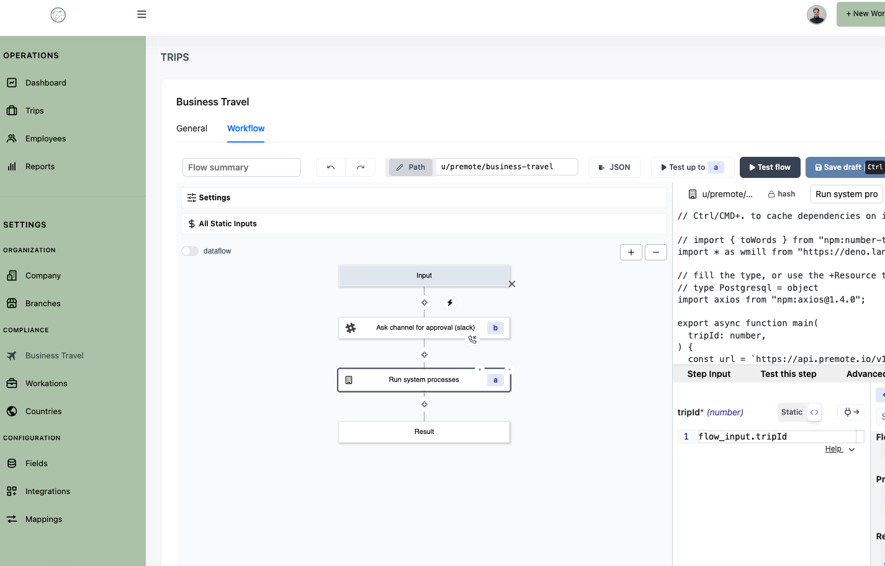

import DocCard from '@site/src/components/DocCard';

# White Labeling Windmill

Windmill offers white labeling capabilities, allowing you to customize the Windmill platform to align with your brand. We do provide a library to embed the entire Windmill app or specific components - such as the flow builder or the app builder - into your own application or website. This enables you to provide Windmill's services to your clients while maintaining your brand's identity.

Windmill offers an SDK compatible with any framework, simplifying its integration across various platforms.

Whitelabel SDKs are also available for cloud with any package. Please contact us for more details.

For more information about white labeling and customization options, please reach out to us at contact@windmill.dev, [Discord](https://discord.com/invite/V7PM2YHsPB), or schedule a [meeting](https://www.windmill.dev/book-demo).

    <DocCard
    	title="Get in Touch"
    	description="Send email to contact@windmill.dev to talk about partnership."
    	href="mailto:contact@windmill.dev"
    />

 

> Example of Windmill's [flow editor](../../flows/1_flow_editor.mdx) being white labeled by [Premote](https://www.premote.nl/):

