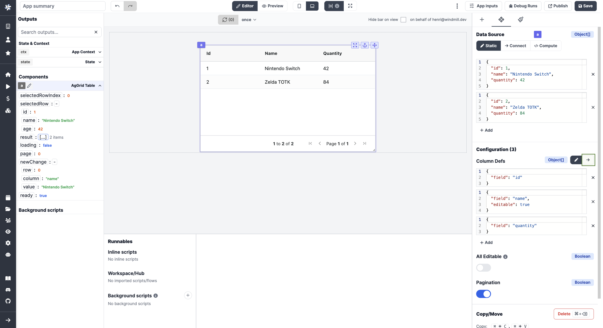
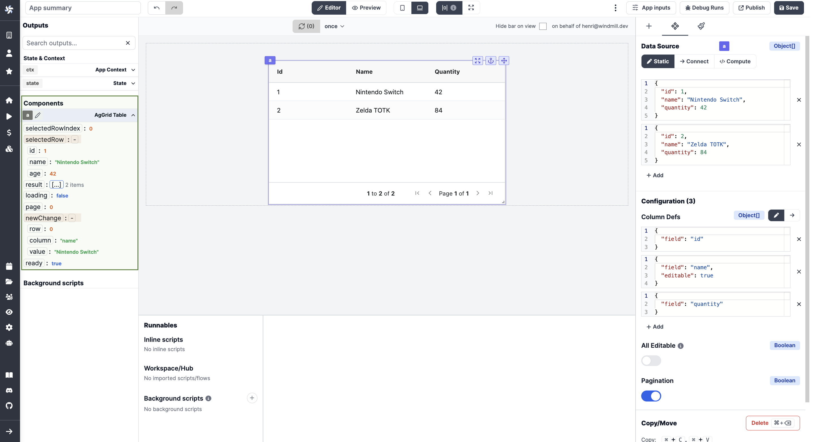

# AgGrid Table 

This is a basic introduction on how to use [AgGrid Table](https://www.ag-grid.com/) together with Windmill.
It assumes little to no knowledge about AgGrid.


## What is AgGrid Table.
The AgGrid Table component (called AgGrid from here) is a small wrapper around a fantstic libary called  [AgGrid](https://www.ag-grid.com/).
It provides you with a lot of advanced features. It comes in a free and a Enterprise (paid) version. 
All features below are part of the free version of AgGrid. 

:::tip Enterprise 
If you need the enterprise version of AgGrid, please [contact us](../../6_getting_help/index.md).
::: 

## AgGrid vs Table component 

In Windmill there are 2 table components: one simply called [Table](../../../apps/4_app_component_library.md#table) and AgGrid. 

The Table component is for basic usecases. It takes an array of objects as input, and uses the key of the object as the header of the table. It also provides you with one or more action buttons to trigger an action for the row.

But if you want the user to be able to sort the table, edit a value, adjust width and more you want to reach for AgGrid.

:::info Transformer     
  If you want to do basic sorting, or edit the column header name from the script you can also use a Transformer script. 
  See the [documentation](../../../apps/6_app_settings.md#tranformers) for more information.
::: 

## Column Definition

AgGrid needs two inputs, rowdata and column definitions. 
By default AgGrid does not show the rowdata. You need to specify the properties of each column. 
This is done in the Configuration on the right side.


You can staticly set the properties of each column and many properties are available.
Let's walk trough the one you may be most likley to use:

* field (string) - which field to use from the rowdata  | [documentation](https://www.ag-grid.com/javascript-data-grid/column-properties/#reference-columns-field)
* headerName (string) - rename the column header to something other than the field name | [documentation](https://www.ag-grid.com/javascript-data-grid/column-properties/#reference-header-headerName)
* sortable (boolean)- should the column be sortable by the user |  [documentation](https://www.ag-grid.com/javascript-data-grid/column-properties/#reference-sort-sortable)
* sort (asc|desc) - which order to sort the column | [documentation](https://www.ag-grid.com/javascript-data-grid/column-properties/#reference-sort-sort)
* resizable (boolean) - should the column be resizable | [documentation](https://www.ag-grid.com/javascript-data-grid/column-properties/#reference-width-resizable)
* rowDrag (boolean) - should the user be able to drag the column | [documentation](https://www.ag-grid.com/javascript-data-grid/column-properties/#reference-row%20dragging-rowDrag)

There is *a lot* more properties, this is just the first few. 
See [Column Properties](https://www.ag-grid.com/javascript-data-grid/column-properties/) for the complete list of properties.

### Dynamicly configure the column definition

As with most things, Windmill lets you **dropdown to code** when you want to do more advanced stuff, where the gui is more in the way then helping.

The Windmill way wil be to first create a background runnable and then connecting it with the col def.



Here you can provide your own column definition that is more then a JSON but also includes classes and functions. 

Below is a series of snippest that will help you get started.

#### Provide default values for all columns

Create a background runnable in deno with the following content:
```js 
   export async function main() {
  const columnDef = [
    {
      field: "name",
      headerName: "Full name",
    },
    {
      field: "age",
      sortable: false,
    },
  ];

  const defaultColumnProperties = {
    sortable: true,
  };

  return columnDef.map((col) => ({ ...defaultColumnProperties, ...col }));
}
``` 

#### Provide default values for all columns

Create a background runnable in deno with the following content:
```ts 
   export async function main() {
  const columnDef = [
    {
      field: "name",
      headerName: "Full name",
    },
    {
      field: "age",
      sortable: false,
    },
  ];

  const defaultColumnProperties = {
    sortable: true,
  };

  return columnDef.map((col) => ({ ...defaultColumnProperties, ...col }));
}
```

#### Create a select button 

Here we are using a AgGrid Component called `agSelectCellEditor`. There [exist more predefined cell components](https://www.ag-grid.com/javascript-data-grid/provided-cell-editors/#select-cell-editor) like this. 


Create a frontend script in JS with the following content:
```js 
return [
    {
        field: "name",
        headerName: "Full name",
    },
    {
        field: "age",
        cellEditorParams: function(params) { 
            return { values: [1, params.data.age, 100 ] }
            },
       cellEditor: 'agSelectCellEditor',
       editable: true,
       useFormatter: true
       
    }
]
```
and connect it to the column definition.

If you want to act on changes in the select dropdown, you may use the components states `newChanges`, or `selectedRow`.




### Create a button (custom component) 
Create a frontend script in JS with the following content:
```js 

class BtnCellRenderer {
  constructor() { }
  init(params) {
    this.params = params;
    this.eGui = document.createElement('button');
    this.eGui.innerHTML = 'Push me!';
    this.btnClickedHandler = this.btnClickedHandler.bind(this);
    this.eGui.addEventListener('click', this.btnClickedHandler);
  }
  getGui() {
    return this.eGui;
  }
  destroy() {
    this.eGui.removeEventListener('click', this.btnClickedHandler);
  }
}
BtnCellRenderer.prototype.btnClickedHandler = function () {
  if(!state.logs) {
    state.logs = []
  }
  state.logs.push({
    rowDataAfterChange: JSON.stringify(this.params.data)
  })
}

return [
  { field: 'name' },
  { field: 'age' },
  {
    "headerName": "Send row data to state",
    "cellRenderer": BtnCellRenderer
  }
]

```
and connect it to the column definition.

This example demonstrates how to create a custom cell renderer component. Where we put the data from the row into 
our state. from here we can use other scripts to act on the row data as we like. 


You can create a lot of components, not only for cell rendering, to understand how check out [AgGrid's documentation for components](https://www.ag-grid.com/javascript-data-grid/components/).