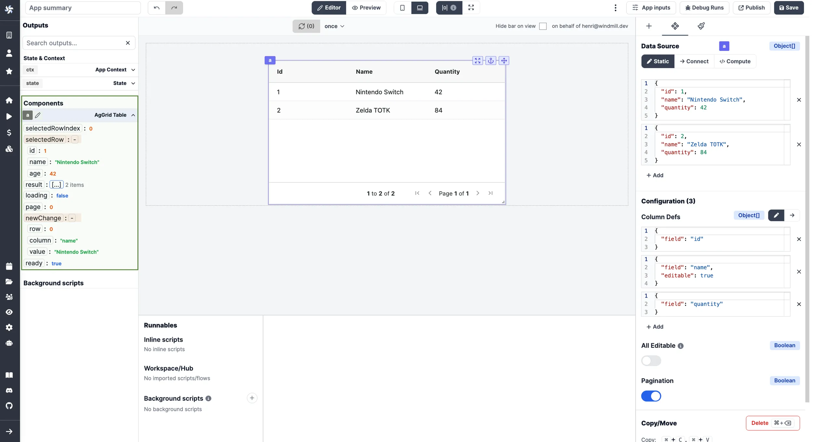

# AgGrid table guide

This is a basic introduction on how to use
[AgGrid table](https://www.ag-grid.com/) together with Windmill. It assumes
little to no knowledge about AgGrid.


## What is AgGrid table

The [AgGrid table component](../../../apps/4_app_configuration_settings/aggrid_table.mdx) (called AgGrid from here) is a small wrapper around a
fantastic library called [AgGrid](https://www.ag-grid.com/). It provides you with
a lot of advanced features. It comes in a free and a Enterprise (paid) version.
All features below are part of the free version of AgGrid.

:::tip Enterprise
If you need the enterprise version of AgGrid, please
[contact us](../../6_getting_help/index.mdx).
:::

## AgGrid vs Table component vs Database studio

In Windmill there are 3 table components: one simply called [Table](../../../apps/4_app_configuration_settings/table.mdx),
[AgGrid](../aggrid_table/index.md) and [Database studio](../../../apps/4_app_configuration_settings/database_studio.mdx).

The [Table component](../../../apps/4_app_configuration_settings/table.mdx) is for most usecases. It takes an array of objects as d
input, and uses the key of the object as the header of the table. It also
provides you with one or more action buttons to trigger an action for the row or
create a dropdown button based on the row data.

[Database studio](../../../apps/4_app_configuration_settings/database_studio.mdx) is a web-based database management tool. It allows you to display and edit the content of a database.

:::info Transformer
If you want to do basic sorting, or edit the column header name from the script
you can also use a Transformer script. See the
[documentation](../../../apps/3_app-runnable-panel.mdx#transformer)
for more information.
:::

## Column definition

AgGrid needs two inputs, rowdata and column definitions. By default AgGrid does
not show the rowdata. You need to specify the properties of each column. This is
done in the Configuration on the right side.


You can statically set the properties of each column and many properties are
available. Let's walk trough the one you may be most likely to use:

- field (string) - which field to use from the rowdata |
  [documentation](https://www.ag-grid.com/javascript-data-grid/column-properties/#reference-columns-field)
- headerName (string) - rename the column header to something other than the
  field name |
  [documentation](https://www.ag-grid.com/javascript-data-grid/column-properties/#reference-header-headerName)
- sortable (boolean)- should the column be sortable by the user |
  [documentation](https://www.ag-grid.com/javascript-data-grid/column-properties/#reference-sort-sortable)
- sort (asc|desc) - which order to sort the column |
  [documentation](https://www.ag-grid.com/javascript-data-grid/column-properties/#reference-sort-sort)
- resizable (boolean) - should the column be resizable |
  [documentation](https://www.ag-grid.com/javascript-data-grid/column-properties/#reference-width-resizable)
- rowDrag (boolean) - should the user be able to drag the column |
  [documentation](https://www.ag-grid.com/javascript-data-grid/column-properties/#reference-row%20dragging-rowDrag)

There is _a lot_ more properties, this is just the first few. See
[Column Properties](https://www.ag-grid.com/javascript-data-grid/column-properties/)
for the complete list of properties.

### Dynamically configure the column definition

As with most things, Windmill lets you **dropdown to code** when you want to do
more advanced stuff, where the gui is more in the way then helping.

The Windmill way will be to first create a background runnable and then
connecting it with the col def.


Here you can provide your own column definition that is more then a JSON but
also includes classes and functions.

Below is a series of snippets that will help you get started.

#### Provide default values for all columns

Create a [background runnable](../../../apps/3_app-runnable-panel.mdx#background-runnables) that is a [Frontend JavaScript](../../../apps/3_app-runnable-panel.mdx#frontend-scripts) with the following content:

```js
const columnDef = [
  {
    field: 'name',
    headerName: 'Full name'
  },
  {
    field: 'age',
    sortable: false
  }
];

const defaultColumnProperties = {
  sortable: true
};

return columnDef.map((col) => ({ ...defaultColumnProperties, ...col }));
```


#### Create a select button

Here we are using a AgGrid Component called `agSelectCellEditor`. There
[exist more predefined cell components](https://www.ag-grid.com/javascript-data-grid/provided-cell-editors/#select-cell-editor)
like this.

Create a [Frontend JavaScript](../../../apps/3_app-runnable-panel.mdx#frontend-scripts) with the following content:

```js
return [
	{
		field: 'name',
		headerName: 'Full name'
	},
	{
		field: 'age',
		cellEditorParams: function (params) {
			return { values: [1, params.data.age, 100] };
		},
		cellEditor: 'agSelectCellEditor',
		editable: true,
		useFormatter: true
	}
];
```

and [connect it](../../../apps/2_connecting_components/index.mdx) to the column definition.

If you want to act on changes in the select dropdown, you may use the components
states `newChanges`, or `selectedRow`.



### Create a button (custom component)

Create a [Frontend JavaScript](../../../apps/3_app-runnable-panel.mdx#frontend-scripts) with the following content:

```js
class BtnCellRenderer {
	constructor() {}
	init(params) {
		this.params = params;
		this.eGui = document.createElement('button');
		this.eGui.innerHTML = 'Push me!';
		this.btnClickedHandler = this.btnClickedHandler.bind(this);
		this.eGui.addEventListener('click', this.btnClickedHandler);
	}
	getGui() {
		return this.eGui;
	}
	destroy() {
		this.eGui.removeEventListener('click', this.btnClickedHandler);
	}
}
BtnCellRenderer.prototype.btnClickedHandler = function () {
	if (!state.logs) {
		state.logs = [];
	}
	state.logs.push({
		rowDataAfterChange: JSON.stringify(this.params.data)
	});
};

return [
	{ field: 'name' },
	{ field: 'age' },
	{
		headerName: 'Send row data to state',
		cellRenderer: BtnCellRenderer
	}
];
```

and [connect it](../../../apps/2_connecting_components/index.mdx) to the column definition.

This example demonstrates how to create a custom cell renderer component. Where
we put the data from the row into our state. from here we can use other scripts
to act on the row data as we like.

You can create a lot of components, not only for cell rendering, to understand
how check out
[AgGrid's documentation for components](https://www.ag-grid.com/javascript-data-grid/components/).
