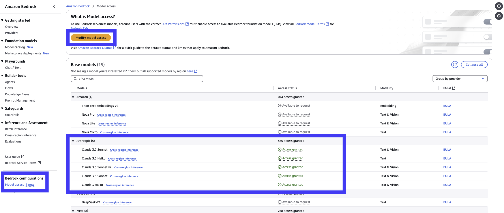

import DocCard from '@site/src/components/DocCard';

# Setting up Windmill AI to use AWS Bedrock

[AWS Bedrock](https://aws.amazon.com/bedrock/) is a service that allows you to use pre-trained models to generate text, images, and other content. It is designed to help developers and operators gain insights into the performance and behavior of their applications and infrastructure. Unfortunately, Bedrock's API is not compatible with OpenAI's API which is why we need to use the Bedrock Access Gateway to access it. Fortunately, AWS provides an easy one-click way to deploy Bedrock Access Gateway on Lambda or Fargate.

<div style={{textAlign: 'center', width: '100%', display: 'flex', justifyContent: 'center'}}>
  
</div>

<div className="grid grid-cols-2 gap-6 mb-4">
	<DocCard
		title="Windmill AI"
		description="Windmill AI provides ways to have AI help you in your coding experience."
		href="/docs/core_concepts/ai_generation"
	/>
    <DocCard
		title="Custom AI models"
		description="Custom AI models are a way to use your own model providers in Windmill AI."
		href="/docs/core_concepts/ai_generation#custom-models"
	/>
	<DocCard
		title="AWS Bedrock User Guide"
		description="AWS Bedrock is a service that allows you to use pre-trained models to generate text, images, and other content."
		href="https://docs.aws.amazon.com/bedrock/latest/userguide/model-access.html"
	/>
  <DocCard
		title="Bedrock Access Gateway"
		description="The Bedrock Access Gateway is a service that allows you to access AWS Bedrock from Windmill."
		href="https://github.com/aws-samples/bedrock-access-gateway"
	/>
</div>

### Create an API Key for Bedrock

Using the AWS CLI, create an API key for Bedrock.

```bash
 aws secretsmanager create-secret \
   --name BedrockProxyAPIKey \
   --description "API key for Bedrock proxy access" \
   --secret-string '{"api_key":"my-custom-api-key"}'
```


If you prefer using the graphical user interface, navigate to the AWS Management Console and navigate to the AWS Secrets Manager service.

1. Click on "Store a new secret" button.

2. In the "Choose secret type" page, select:

    Secret type: Other type of secret Key/value pairs:

    Key: api_key
    Value: Enter your API key value

3. Click "Next"

4. In the "Configure secret" page: Secret name: Enter a name (e.g., "BedrockProxyAPIKey") Description: (Optional) Add a description of your secret

5. Click "Next" and review all your settings and click "Store"

After creation, you'll see your secret in the Secrets Manager console. Make note of the **secret ARN**.

### Create the Bedrock Access Gateway

The [Bedrock Access Gateway](https://github.com/aws-samples/bedrock-access-gateway) is a service that allows you to access AWS Bedrock from Windmill using the standard OpenAI API.

Sign in to AWS Management Console, switch to the region to deploy the CloudFormation Stack to and chose one of the following options:

- [Deploy Bedrock Access Gateway using AWS Lambda](https://console.aws.amazon.com/cloudformation/home?#/stacks/quickcreate?templateURL=https://aws-gcr-solutions.s3.amazonaws.com/bedrock-access-gateway/latest/BedrockProxy.template&stackName=BedrockProxyAPI)
- [Deploy Bedrock Access Gateway using AWS Fargate](https://console.aws.amazon.com/cloudformation/home?#/stacks/quickcreate?templateURL=https://aws-gcr-solutions.s3.amazonaws.com/bedrock-access-gateway/latest/BedrockProxyFargate.template&stackName=BedrockProxyAPI)
 
Click "Next", provide a stack name, enter the secret ARN you used for storing the API key and click "Next". For the rest, you can leave the default settings or customize them according to your needs.

Once deployed, you will find the API Gateway endpoint in the outputs section of the stack.


### Enabling Bedrock model providers on AWS

Now on your AWS console, navigate to the Bedrock console and select the `Model Access` tab.



By default no model providers are enabled. Click on the `Modify Model Access` button and select the model providers you want to enable.

### Configure Windmill AI to use Bedrock

Now that you have the Bedrock Access Gateway deployed and the model providers enabled, you can configure Windmill AI to use Bedrock.

In your workspace settings, navigate to the `Windmill AI` tab and select the `Custom AI` provider and click the + button to add a new model resource where you will enter the following details:

- Name: The name of the model resource.
- Description: The description of the model resource.
- API Key: The API key for the Bedrock Access Gateway.
- API URL: The API URL for the Bedrock Access Gateway.


Next, you will select the models you want to use from the Bedrock model providers.

:::warning
You can only select the models that are enabled in the Bedrock model providers. Furthermore, the model needs to support max tokens of 4096 (Anthropic Haiku 3 does not support this for example).
:::


You can find the model ids in the AWS Bedrock console on the "Cross-region inference" tab.


### Using Windmill AI

Now that you have configured Windmill AI to use Bedrock, you can use it in your scripts.


