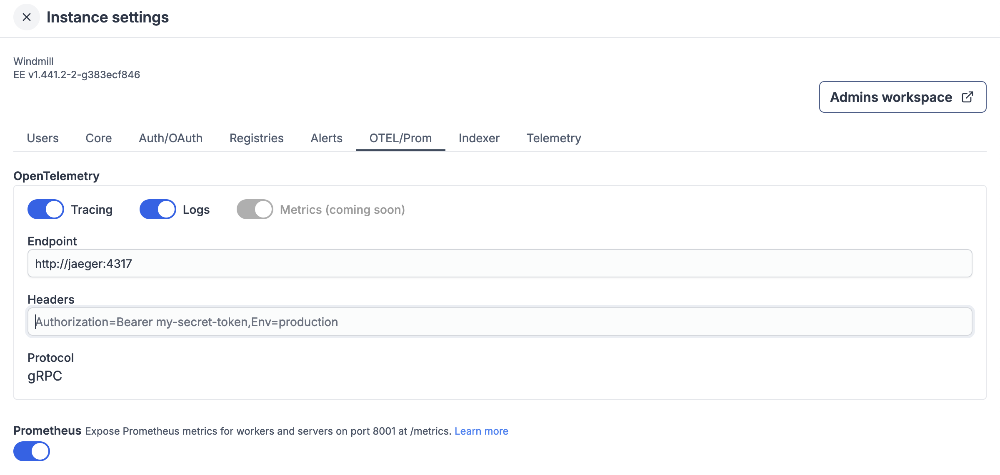
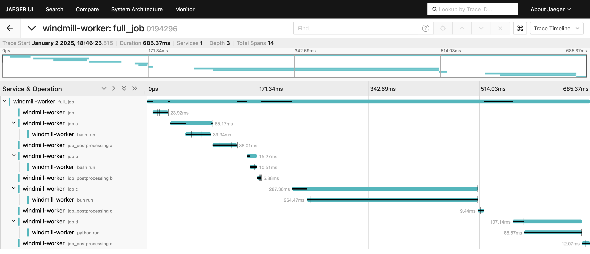
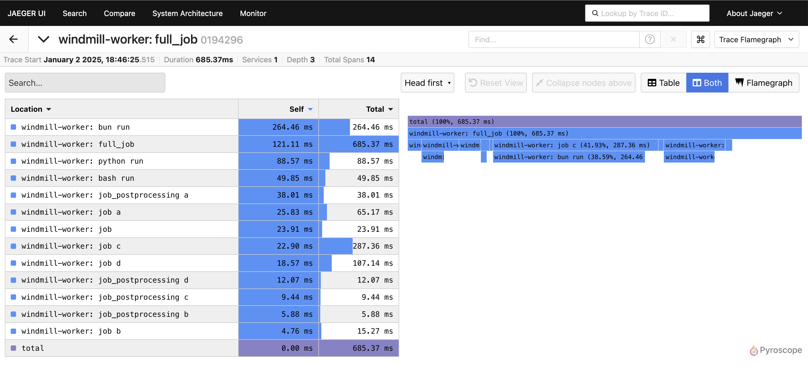
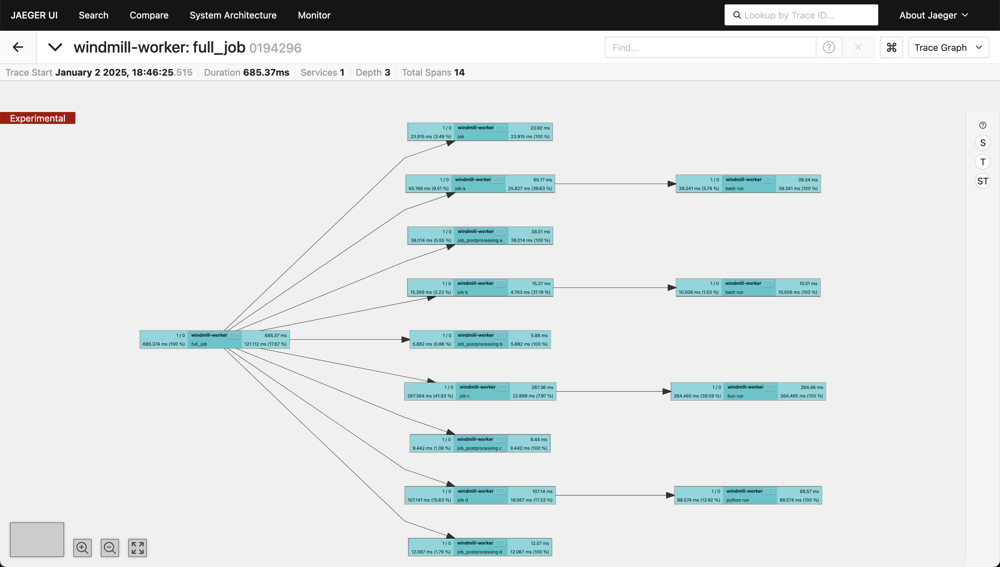
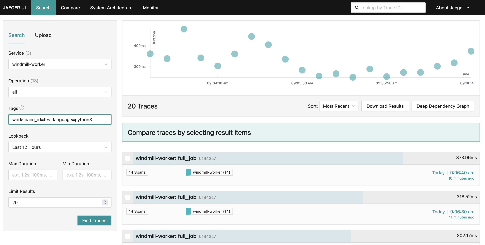
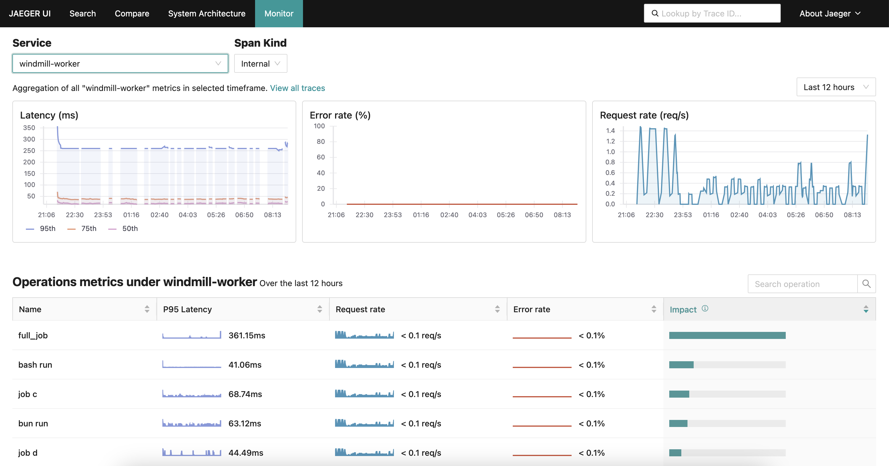
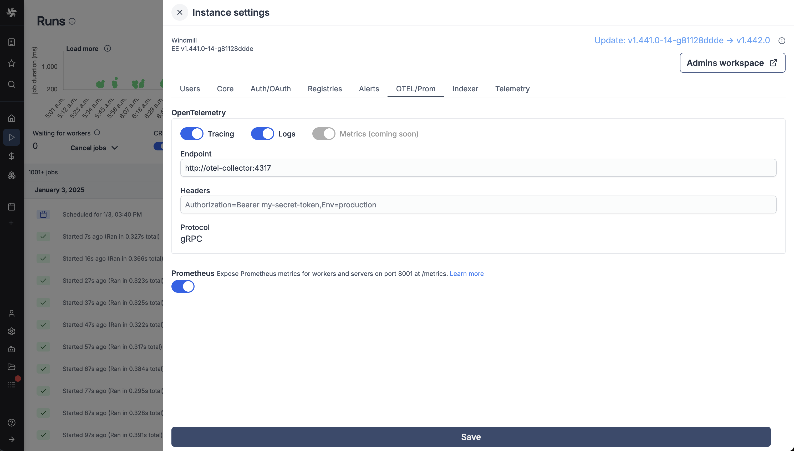
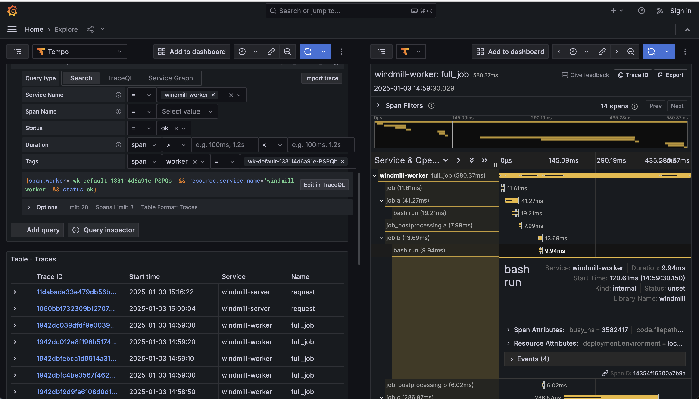
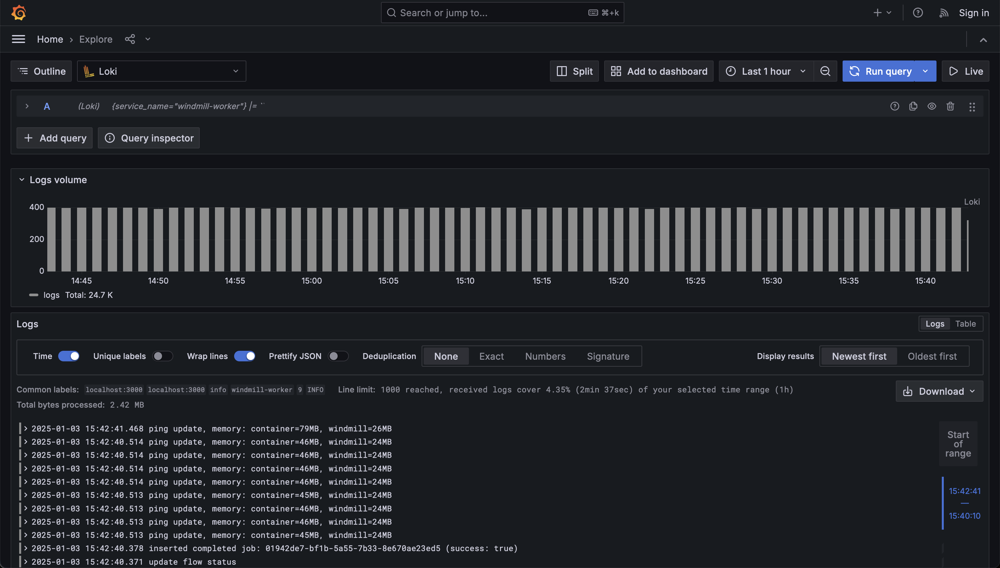
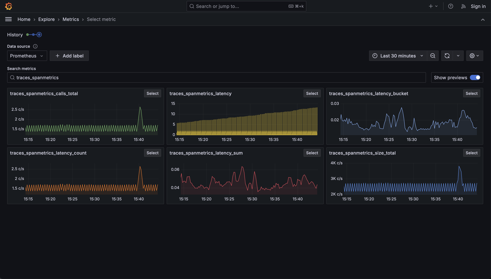

import DocCard from '@site/src/components/DocCard';

# Windmill Tracing & Logs with OpenTelemetry

[OpenTelemetry (OTEL)](https://opentelemetry.io/) is an open-source observability framework that provides a set of APIs, libraries, agents, and instrumentation to capture and export telemetry data such as traces, metrics, and logs. It is designed to help developers and operators gain insights into the performance and behavior of their applications and infrastructure.

### Core Components and Vocabulary

- **Traces**: Represent the execution path of a request as it traverses through various services. A trace is composed of multiple spans.
- **Spans**: The building blocks of a trace, representing a single operation within a trace. Each span contains metadata such as operation name, start and end timestamps, and attributes.
- **Metrics**: Quantitative data that measures the performance of a system, such as CPU usage, memory consumption, or request count.
- **Logs**: Records of events that occur within a system, providing context and details about operations and errors.
- **Instrumentation**: The process of adding code to applications to collect telemetry data. OpenTelemetry provides SDKs and APIs for this purpose.
- **Collector**: A component that receives, processes, and exports telemetry data to various backends. It acts as a central hub for telemetry data.

While Windmill offers internal service logs and alerts accessible via the Windmill UI, integrating OpenTelemetry can be beneficial for users who wish to centrally aggregate and manage traces and logs. This centralized approach allows for enhanced alerting, monitoring, and analysis capabilities, enabling users to proactively address issues and optimize their systems.

<div className="grid grid-cols-2 gap-6 mb-4">
	<DocCard
		title="Example deployment with Jaeger"
		description="Download this folder and run `docker compose up` to start a Windmill instance with Jaeger and Prometheus."
		href="https://github.com/windmill-labs/windmill/tree/main/examples/deploy/otel-tracing-jaeger"
	/>
    <DocCard
		title="Example deployment with Tempo"
		description="Download this folder and run `docker compose up` to start a Windmill instance with Grafana, Tempo and Loki."
		href="https://github.com/windmill-labs/windmill/tree/main/examples/deploy/otel-tracing-grafana"
	/>
	<DocCard
		title="Instance settings"
		description="Instance settings are where you can configure OTEL/Prometheus settings."
		href="/docs/advanced/instance_settings#opentelemetry-otel"
	/>
</div>

# Tracing with Jaeger

[Jaeger](https://www.jaegertracing.io/) Jaeger is an open-source distributed tracing system for monitoring and debugging microservices. Originally developed by Uber, it helps track requests across services, analyze latency, identify bottlenecks, and diagnose failures.

Key use cases include debugging production issues, monitoring performance, visualizing service dependencies, and optimizing system reliability. As Jaeger supports the OpenTelemetry protocol, it can be used to collect traces from Windmill.

## Setting up Jaeger

If you do not have an existing Jaeger instance, you can start a container running Jaeger with by adding the following to your `docker-compose.yml` file or use this [docker-compose.yml](https://github.com/windmill-labs/windmill/tree/main/examples/deploy/otel-tracing-jaeger) file as a starting point.

```yaml
  jaeger:
    image: jaegertracing/jaeger:latest
    ports:
      - "16686:16686"
    expose:
      - 4317
```

this will expose Jaegers UI on port 16686 and the OpenTelemetry collector on port 4317.

## Configuring Windmill to use Jaeger

In the Windmill UI, go to the "Instances Settings" and "OTEL/Prom" tab and fill in the Jaeger endpoint and service name and toggle the Tracing option to send traces to Jaeger.

If you are using the Jaeger container, the endpoint will be `http://jaeger:4317`.



## Open the Jaeger UI

The Jaeger UI if hosted with the `docker-compose.yaml` file above will be available at `http://localhost:16686`. When running a script or workflow with Windmill, you will be able to see the traces in the Jaeger UI and investigate them. This can be useful to understand the performance of a workflow and identify bottlenecks in the Windmill server or client.





## Searching for specific traces

To search/filter for a specific trace, for example a workflow, you can use the search function in the Jaeger UI by filtering by tags set by Windmill.

The following tags are useful to filter for specific traces:

- `job_id`: The ID of the job
- `root_job`: The ID of the root job (flow)
- `parent_job`: The ID of the parent job (flow)
- `flow_step_id`: The ID of the step within the workflow
- `script_path`: The path of the script
- `workspace_id`: The name of the workspace
- `worker_id`: The ID of the worker
- `language`: The language of the script
- `tag`: The queue tag of the workflow



## Monitoring metrics with Jaeger

Jaeger can be used to generate time series for metrics of the collected traces. These time series can be used to compare the performance of individual steps within a workflow and their overall
performance and realtive contribution over time as well as identify and troubleshoot issues and anomalies.

To set this up, Jaeger needs to store the generated metrics in PromQL-compatible storage such as Prometheus.

If you do don't have an existing Prometheus instance, you can start one with the following in your `docker-compose.yml` file or uncomment the prometheus service in the [docker-compose.yml](https://github.com/windmill-labs/windmill/tree/main/examples/deploy/otel-tracing-jaeger) file in the Windmill repo.

```yaml
  prometheus:
    image: prom/prometheus:latest
    expose:
      - 9090
    volumes:
      - ./prometheus-config.yaml:/etc/prometheus/prometheus.yml
    command:
      - "--config.file=/etc/prometheus/prometheus.yml"
```

with the following `prometheus-config.yaml` file:

```yaml
global:
  scrape_interval: 15s
  evaluation_interval: 15s

scrape_configs:
  - job_name: aggregated-trace-metrics
    static_configs:
    - targets: ['jaeger:8889']
```    

In order to use prometheus with Jaeger, you need to configure Jaeger to send metrics to Prometheus. For this we will mount a config file to the Jaeger container that will enable the metrics export.

In the docker-compose.yml file, add the following to the Jaeger service:

```yaml
  jaeger:
    image: jaegertracing/jaeger:latest
    ports:
      - "16686:16686"
    expose:
      - 4317
      - 8889
    volumes:
      - ./jaeger-config.yaml:/etc/jaeger/config.yml
    command: ["--config", "/etc/jaeger/config.yml"]
```

and the following `jaeger-config.yaml` file:

```yaml
service:
  extensions: [jaeger_storage, jaeger_query]
  pipelines:
    traces:
      receivers: [otlp]
      processors: [batch]
      exporters: [jaeger_storage_exporter, spanmetrics]
    metrics/spanmetrics:
      receivers: [spanmetrics]
      exporters: [prometheus]
  telemetry:
    resource:
      service.name: jaeger
    metrics:
      level: detailed
      address: 0.0.0.0:8888
    logs:
      level: DEBUG

extensions:
  jaeger_query:
    storage:
      traces: some_storage
      metrics: some_metrics_storage
  jaeger_storage:
    backends:
      some_storage:
        memory:
          max_traces: 100000
    metric_backends:
      some_metrics_storage:
        prometheus:
          endpoint: http://prometheus:9090
          normalize_calls: true
          normalize_duration: true

connectors:
  spanmetrics:

receivers:
  otlp:
    protocols:
      grpc:
        endpoint: "0.0.0.0:4317"

processors:
  batch:

exporters:
  jaeger_storage_exporter:
    trace_storage: some_storage
  prometheus:
    endpoint: "0.0.0.0:8889"
```

In the Jaeger UI, you will now be able to see metrics time series for the traces in the "Monitor" tab.



# Tracing with Tempo and Grafana

[Tempo](https://grafana.com/docs/tempo/) is a distributed tracing system that is part of the Grafana stack. It is designed to collect, store, and query traces from distributed systems. Tempo is a scalable and efficient solution for tracing, providing a comprehensive view of the performance and behavior of your applications and infrastructure.

## Setting up an OpenTelemetry collector and Tempo

Use the [docker-compose.yml](https://github.com/windmill-labs/windmill/tree/main/examples/deploy/otel-tracing-grafana) file in the Windmill repo as a starting point. Compared to the Jaeger setup, this setup also includes a Loki instance to store the logs as well as a dedicated OpenTelemetry collector that will be used to collect traces from the Windmill instance and distribute them to Tempo and Loki.

It you already have a Tempo instance and/or Loki instance, make sure to update the OpenTelemetry collector configuration to point to your existing Loki and Tempo instances.

OpenTelemetry collector configuration:

```yaml
receivers:
  otlp:
    protocols:
      grpc:
        endpoint: 0.0.0.0:4317

processors:
  batch:
    timeout: 5s

exporters:
  otlphttp/loki:
    endpoint: http://loki:3100/otlp
    tls:
      insecure: true
  otlp/tempo:
    endpoint: http://tempo:4317
    tls:
      insecure: true

service:
  pipelines:
    traces:
      receivers: [otlp]
      processors: [batch]
      exporters: [otlp/tempo]
    logs:
      receivers: [otlp]
      processors: [batch]
      exporters: [otlphttp/loki]
```

In the Tempo configuration we'll enable the metrics pipeline and set the metrics storage to point to the Prometheus instance. As with Jaeger, this will allow us to query metrics in Grafana.

Tempo configuration:

```yaml
stream_over_http_enabled: true
server:
  http_listen_port: 3200
  log_level: info

query_frontend:
  search:
    duration_slo: 5s
    throughput_bytes_slo: 1.073741824e+09
    metadata_slo:
        duration_slo: 5s
        throughput_bytes_slo: 1.073741824e+09
  trace_by_id:
    duration_slo: 5s

distributor:
  receivers:
    otlp:
      protocols:
        grpc:
          endpoint: "tempo:4317"

ingester:
  max_block_duration: 5m

compactor:
  compaction:
    block_retention: 1h

metrics_generator:
  registry:
    external_labels:
      source: tempo
      cluster: windmill
  storage:
    path: /var/tempo/generator/wal
    remote_write:
      - url: http://prometheus:9090/api/v1/write
        send_exemplars: true
  traces_storage:
    path: /var/tempo/generator/traces

storage:
  trace:
    backend: local
    wal:
      path: /var/tempo/wal
    local:
      path: /var/tempo/blocks

overrides:
  defaults:
    metrics_generator:
      processors: [service-graphs, span-metrics, local-blocks]
      generate_native_histograms: both
```

## Setting up Loki

Loki is a log storage system that is part of the Grafana stack. It is designed to store and query logs from distributed systems. Loki is a scalable and efficient solution for logging, providing a comprehensive view of the performance and behavior of your applications and infrastructure.

Learn more about Loki and how to configure it [here](https://grafana.com/docs/loki/latest/). For Windmill, we'll use the in-memory storage backend and set the HTTP listen port to 3100 but you can configure it to use a persistent storage backend and change the port and other settings as needed.

Loki configuration:

```yaml
auth_enabled: false

server:
  http_listen_port: 3100

common:
  ring:
    instance_addr: 0.0.0.0
    kvstore:
      store: inmemory
  replication_factor: 1
  path_prefix: /tmp/loki

schema_config:
  configs:
  - from: 2020-05-15
    store: tsdb
    object_store: filesystem
    schema: v13
    index:
      prefix: index_
      period: 24h

storage_config:
  filesystem:
    directory: /tmp/loki/chunks

limits_config:
  allow_structured_metadata: true
```

## Setting up Prometheus

Prometheus is a monitoring and observability platform that is part of the Grafana stack. In this context it is designed to store and query metrics generated by Tempo.

Learn more about Prometheus and how to configure it [here](https://prometheus.io/docs/prometheus/latest/).

Prometheus configuration:
```
global:
  scrape_interval:     15s
  evaluation_interval: 15s

scrape_configs:
  - job_name: 'prometheus'
    static_configs:
      - targets: [ 'localhost:9090' ]
  - job_name: 'tempo'
    static_configs:
      - targets: [ 'tempo:3200' ]
```

## Setting up Grafana

Grafana is a monitoring and observability platform that is part of the Grafana stack. It is designed to visualize and query metrics, traces and logs from distributed systems.

Learn more about Grafana and how to configure it [here](https://grafana.com/docs/grafana/latest/). For Windmill, we'll use the Tempo datasource for traces and Loki as a log datasource. Furthermore, metrics can be visualized in Grafana by using the Prometheus datasource and the metrics generated by Tempo.

## Configure Windmill to use Tempo and Loki

In the Windmill UI, go to the "Instances Settings" and "OTEL/Prom" tab and fill in the OpenTelemetry collector endpoint `http://otel-collector:4317` and toggle both the Tracing and Logs options.



## Open the Grafana UI

The Grafana UI if hosted with the `docker-compose.yaml` file above will be available at `http://localhost:3000`.

### Traces
As with Jaeger, you can search for specific traces by filtering by tags set by Windmill.



### Logs
For logs, select the Loki datasource and you will be able to see the logs in the Loki UI.



### Metrics
For metrics, select the Prometheus datasource and you will be able to see the metrics in the Prometheus UI.

The metrics generated by Tempo are labeled as:

- traces_spanmetrics_calls_total
- traces_spanmetrics_latency
- traces_spanmetrics_latency_bucket
- traces_spanmetrics_latency_count
- traces_spanmetrics_latency_sum
- traces_spanmetrics_size_total

