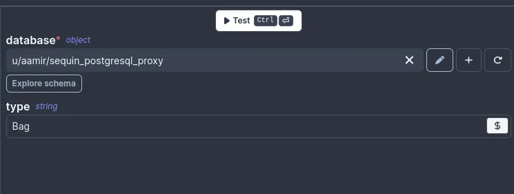

import DocCard from '@site/src/components/DocCard';
import { SiPostgresql } from 'react-icons/si';

# Use SQL to build on external APIs using Sequin

This guide is provided by [Sequin](https://sequin.io). With Sequin, developers can build on top of third-party services like Salesforce or HubSpot using SQL.

Sequin runs a real-time sync process that pulls data from external APIs into your Postgres database. Any time a record changes in the API, that change is synced to your database. Likewise, Sequin intercepts mutations you make to records in your database. It applies them to the API first before committing them to your database.

You can use Sequin to build Windmill apps on top of third-party services using Windmill's PostgreSQL [resource](../../../core_concepts/3_resources_and_types/index.mdx). This means all your scripts can be written in SQL, even if they’re reading data from [Salesforce](https://www.salesforce.com/) or writing data to [HubSpot](https://www.salesforce.com/). You can `join` your API data with your internal data. And because your API data is cached in Postgres, you don't need to worry about rate limits or pagination.

<div className="grid grid-cols-2 gap-6 mb-4">
	<DocCard
		title="Resources and Resource Types"
		description="Resources are structured configurations and connections to third-party systems, with Resource Types defining the schema for each Resource."
		href="/docs/core_concepts/resources_and_types"
	/>
	<DocCard
		title="Guide on Sequin.io"
		description="Original guide on Sequin.io"
		href="https://docs.sequin.io/guides/windmill"
		target="_blank"
	/>
</div>

## Setup a Sequin sync

Before you can use Sequin with Windmill, you'll need to create a Sequin sync to your Postgres database:

**Step 1**: After [signing up for Sequin](https://app.sequin.io), you'll connect Sequin to the API you want to sync:


<br />

**Step 2**: Configure your schema by selecting the tables and columns you want to sync.

**Step 3**: Then, Sequin will prompt you to connect to your Postgres database. Alternatively, you can use a free demo Postgres instance that Sequin hosts.

**Step 4**: After you click "Create", Sequin will begin syncing your data.

Sequin will provide you with the connection instructions for your Postgres database. Keep this tab open, as you'll need it to configure Windmill:


<br />

For more details on setting up a Sequin sync, [see this guide](https://docs.sequin.io/getting-started#create-a-sync).

## Create a Windmill Resource

Windmill provides integrations with many different apps and services with [resources](../../../core_concepts/3_resources_and_types/index.mdx). Each Resource has a Resource Type (PostgreSQL, MySQL, MS SQL, BigQuery, Snowflake) that defines the schema that the resource of this type needs to implement.

Sequin uses a [Postgres Proxy](https://docs.sequin.io/writes#configuration) to interface with your Sequin-synced tables. The Proxy lets Sequin capture inserts, updates, and deletes you make in your database and commit them to the API.

To add Sequin's Postgres Proxy as a Windmill Resource, you can treat it as a regular Postgres Resource and enter the connection details in the Resource configuration:

**Step 1**: Go to your Windmill dashboard and find "Resources" on the left sidebar. Click on the “Add Resource” button

**Step 2**: Select PostgreSQL type.

**Step 3**: Fill out the form with the information. Give it a name and paste the values for host, database name, database username, and database password from the _Connection instructions_ tab of your Sequin dashboard.
Using the Postgres Resource in Windmill

Now, Sequin is syncing your API data to Postgres. You've also connected Windmill to Postgres via Sequin's Proxy. To query this data in your Windmill app, go back to your Windmill dashboard and find “Home”:

**Step 1**: From the <a href="https://app.windmill.dev/" rel="nofollow">Home page</a>, click on the "+ Script" button.

**Step 2**: Name the Script, give it a summary, and select your “PostgreSQL” as language.

**Step 3**: In the list of Resources, select the Postgres connection to Sequin.

**Step 4**: Compose your query. The schema for your Sequin-synced tables is available if you click “Explore schema” button right under the database name.

**Step 5**: Click the "Test" button on the top right to make sure your query runs as expected.

Here's an example Airtable query that returns all the product names in the Products Inventory table, which are of the type “Bag”.

```sql
-- $1 type = Bag
/*Assumes the default value Bag but can be changed from the menu.*/
SELECT product_name from airtable.product_inventory WHERE type = $1::TEXT
```

The type is an argument with a default value of “Bag” but you can always pass a different value from the input field right below the “Test” button.



## Writing back to the API

With Sequin, you can also make [mutations](https://docs.sequin.io/writes) via your database as well. Inserts, updates, and deletes you make to Sequin-synced tables are first applied to the API. If they pass validation, they're committed to your database.

To write your first mutation query, navigate to "Home" on the left sidebar and click the “+ Script” button.

In the list of Resources, select the Postgres connection to Sequin.

You can compose an `insert` query by populating `values` with various input fields in your application. For example, if you have a form with inputs named `first_name`, `last_name`, and `email`, the corresponding `insert` query would look like this:

```sql
insert into salesforce.contact (first_name, last_name, email)
values ($1::TEXT, $2::TEXT, $3::TEXT);
```

Provide argument values and click on the "Test" button in the top right to execute the insert query.


## Errors

When Sequin's Proxy encounters an error trying to apply your mutation in the upstream API, the Proxy returns a standard Postgres error. You can configure your app to display this as an alert notification.

Let’s say you make a mutation to a Salesforce Contact with an invalid email. Salesforce will return a validation error. You can configure your Windmill app to display this as a helpful error message.

As an example, Windmill has a Submit button with an **onFailure** property. You can display an error message to the user if the script throws an error:


By setting "Append Error" to true, Windmill will append the error returned by Salesforce to the toast notification:


## Next steps

With Sequin, you can build Windmill apps on top of sources like Salesforce, Airtable, and HubSpot. To learn more, check out our docs on [building SQL scripts](../../../getting_started/0_scripts_quickstart/5_sql_quickstart/index.mdx) and read more about [how Sequin works](https://docs.sequin.io/).

<div className="grid grid-cols-2 gap-6 mb-4">
	<DocCard
		title="SQL Quickstart"
		description="Write your first Windmill script in PostgreSQL, MySQL, MS SQL, BigQuery or Snowflake SQL."
		href="/docs/getting_started/scripts_quickstart/sql"
		Icon={SiPostgresql}
	/>
</div>
