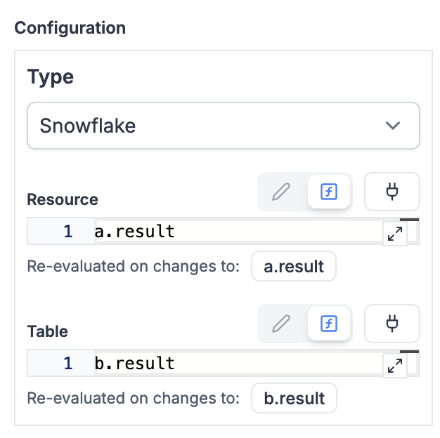
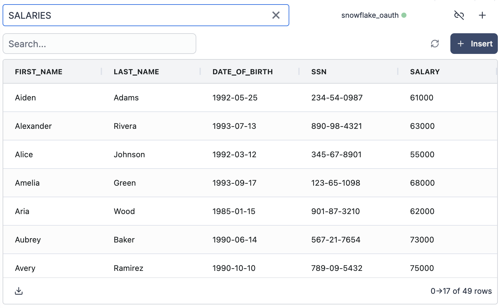
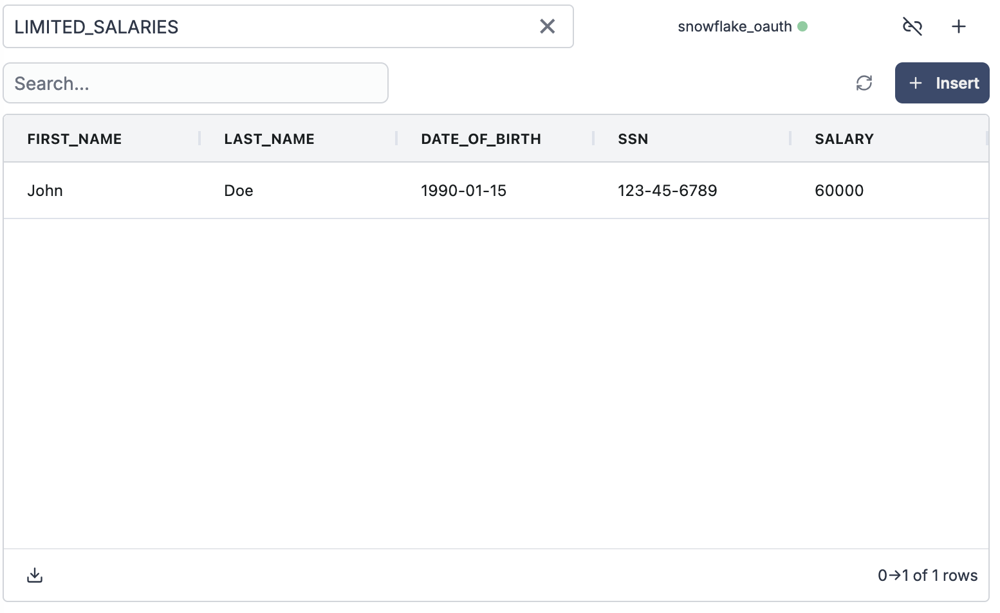

import DocCard from '@site/src/components/DocCard';
import { SiPostgresql } from 'react-icons/si';


# Build an App Accessing Snowflake with End-User Roles

This guide walks you through building an application that accesses Snowflake data based on the end-user’s role, using OAuth in Windmill. By leveraging dynamic role-based credentials from Snowflake’s OAuth integration, we avoid static credentials and enable secure data access customized for each user. 

The tutorial includes steps to set up Snowflake OAuth, configure user roles, and create UI components in Windmill for a seamless, role-specific data experience.

<div className="grid grid-cols-2 gap-6 mb-4">
	<DocCard
		title="Resources and resource types"
		description="Resources are structured configurations and connections to third-party systems, with Resource Types defining the schema for each Resource."
		href="/docs/core_concepts/resources_and_types"
	/>
	<DocCard
		title="Snowflake OAuth"
		description="Setup a Snowflake OAuth connection"
		href="/docs/misc/setup_oauth#snowflake"
		target="_blank"
	/>
</div>

---

## Prerequisites

1. **Set up Snowflake OAuth**: Follow the [Snowflake OAuth guide](/docs/misc/setup_oauth#snowflake).
2. **Configure User Roles in Snowflake**: In the [Snowflake console](https://app.snowflake.com/), ensure that user roles connected through OAuth have access to the relevant tables.

## Sample App Setup

For this example, we created a new Snowflake organization with a `WINDMILL` database, a `PUBLIC` schema, and two user roles:

- **hr_user** with the role `PRIVILEGED`
- **support_user** with the role `RESTRICTED`

The database contains the following tables:
- **SALARIES** – accessible only to the `PRIVILEGED` role
- **LIMITED_SALARIES** – accessible to both roles

The goal is to use OAuth to dynamically retrieve the credentials for the end-user connecting to the app rather than using static credentials.

### Step 1: Create a New Snowflake OAuth User Resource
1. After creating a new app in your Windmill workspace, add a **User Resource Input** component.
2. For "Resource Type," enter `snowflake_oauth`.
3. Enable **Express OAuth Setup** by toggling the option.

   

4. In the UI editor, click the plus icon (+) to authenticate with your Snowflake account and test the connection.

This component allows the app to use end-user credentials via an interactive OAuth connection rather than relying on static resources defined in the workspace.

### Step 2: Query Available Tables

Next, create a **Background Runnable** to retrieve the available tables based on the user’s Snowflake role.

1. Create a new **Background Runnable** of type "Snowflake."

   

2. Enter a Snowflake query to list available tables:

   ```sql
   SELECT TABLE_NAME FROM INFORMATION_SCHEMA.TABLES WHERE TABLE_SCHEMA = 'PUBLIC';
   ```

3. Connect the **Background Runnable** to the **User Resource Input** component from Step 1 by clicking the connect icon and selecting the result field of the **User Resource Input**.

4. Enable the toggle **resource from users allowed** to grant access to user-linked resources. Note that this resource is passed as a reference and won’t be accessible to the app publisher.

   

5. Click the **Run** button to test the query and view the results.

6. Create a **Select** component and connect it to the **Background Runnable** output to populate the dropdown menu. Map the output to `label` and `value` fields as follows:

   ```js
   bg_0.result.map(_ => ({ value: _.TABLE_NAME, label: _.TABLE_NAME }))
   ```

### Step 3: Display Table Content

Now, add a **Database Studio Table** component to show the table content based on the selected table.

1. Create a **Database Studio Table** component.
2. Connect the **Database Studio Table**’s "resource" field to the **User Resource Input** component from Step 1.
3. Connect the **Database Studio Table**’s "table" field to the **Select** component created in Step 2.

   

4. The component will automatically populate with data from the selected table.

### Step 4: Test the App

Now, we’ll see how the displayed data changes based on the logged-in user’s role.

1. Click the **Preview** button to switch to the end-user preview mode.
2. Use the plus icon (+) to log in as a privileged user (e.g., **hr_user**) and view the content of the `SALARIES` table.

   

3. Log out by clicking the logout button next to the plus icon, then log in as the restricted user (e.g., **support_user**). You should now see only the `LIMITED_SALARIES` table.

   

### Step 5: Video Tutorial

For a visual walkthrough of building this app, watch the tutorial below:

<iframe
    style={{ aspectRatio: '16/9' }}
    src="https://www.youtube.com/embed/8Mk_4ErioeE"
    title="Small tutorial on how to build a Windmill App that uses Snowflake as a data source with OAuth roles and permissions"
    frameBorder="0"
    allow="accelerometer; autoplay; clipboard-write; encrypted-media; gyroscope; picture-in-picture; web-share"
    allowFullScreen
    className="border-2 rounded-lg object-cover w-full dark:border-gray-800"
></iframe>
