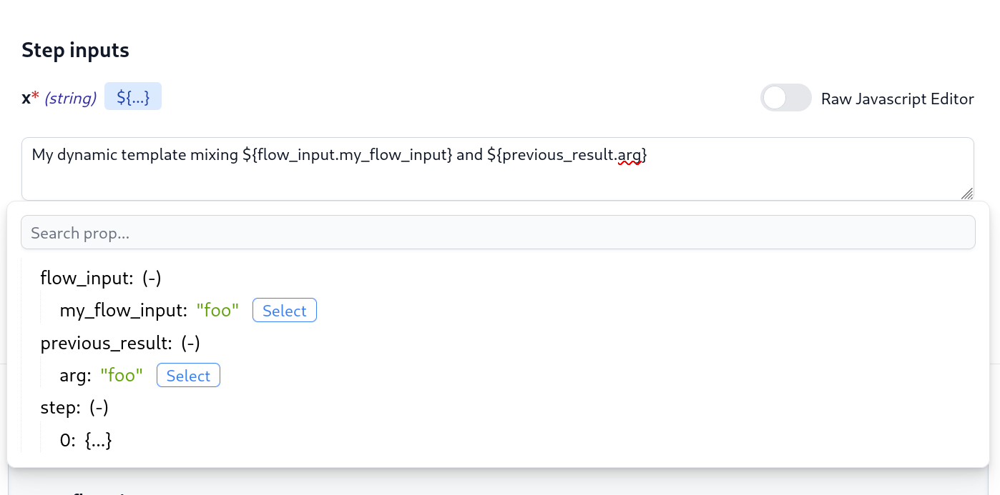

# OpenFlow Spec

OpenFlow is an open standard for defining "Flows". Flows are directed
graphs in which every node represents a step of computation. In other words, it
is a declarative language for chaining scripts.

Windmill is the open-source reference implementation for it, providing an UI to
build flows and a highly scalable executors. However everyone is welcome to
build upon it and to develop new UIs that target OpenFlow, or create new executors.

Flows can be shared and showcased on the
[WindmillHub](https://hub.windmill.dev). To see an example of an OpenFlow in
practice, go to WindmillHub and pick a flow (e.g
[Whenever an HN message contains a mention, publish it to slack](https://hub.windmill.dev/flows/13/whenever-an-hn-message-contains-a-mention%2C-publish-it-to-slack)),
then Flow -> JSON.

## OpenFlow

We provide an OpenAPI/Swagger definition file for the spec, it is hosted 
within the GitHub repository 
[here.](https://github.com/windmill-labs/windmill/blob/main/openflow.openapi.yaml)


We will use a TypeScript equivalent of the OpenAPI definition for ease of
readability throughout the rest of the document.

OpenFlow is portable and its root object is defined as follows:

```typescript
type OpenFlow = {
  summary: string;
  description?: string;
  value: FlowValue;
  schema?: any;
};
```

It contains a short line summary, a description, a schema which is the
JSONSchema that constraints the JSON it takes as an input. FlowValue is where
the logic of the flow is actually defined:

## FlowValue

```typescript
type FlowValue = {
  modules: FlowModule[];
  failure_module?: FlowModule;
  same_worker: boolean
};
```

A Flow is just a sequence of modules, and an optional failure module that will
be triggered to handle a failure at any point of the flow (think `try/catch` in
terms of programming languages).


## FlowModule

An OpenFlow module is defined as follows:

```typescript
type FlowModule = {
  summary?: string;
  value: Identity | RawScript | PathScript | ForloopFlow | BranchOne | BranchAll ;
  stop_after_if?: { expr: string; skip_if_stopped: boolean };
  sleep?: StaticTransform | JavascriptTransform
  suspend?: { required_events?: integer, timeout: integer };
  retry?: {
    constant?: {
      attempts: integer;
      seconds: integer;
    };
    exponential?: {
      attempts: integer;
      multiplier: integer;
      seconds: integer;
    };
  };
};

type StaticTransform = {
  value: any;
};

type JavascriptTransform = {
  expr: string;
};

type RawScript = {
  input_transforms: Record<string, StaticTransform | JavascriptTransform>;
  content: string;
  language: "deno" | "python3";
  path?: string;
};

type PathScript = {
  input_transforms: Record<string, StaticTransform | JavascriptTransform>;
  path: string;
};

type ForloopFlow = {
  modules: FlowModule[];
  iterator: InputTransform;
  skip_failures?: boolean;
};

type BrancheOne = {
  default: FlowModule[];
  branches: Array<{
    summary?: string;
    expr: string;
    modules: FlowModule[];
  }>;
};

type BrancheAll = {
  default: FlowModule[];
  branches: Array<{
    summary?: string;
    skip_failure: boolean;
    modules: FlowModule[];
  }>;
};


```

### Value

There are 5 kinds of modules.

- `rawscript`: Embed a full Typescript/Python/Go script inside the flow. Useful
  for ad-hoc scripts.
- `script`: When you can refer to a script by its path (including a path to the hub
  using the `hub/` prefix)
- `branchone`: Branch to one list of modules based on the first predicate that match (evaluated in-order) or the default modules if none match.
- `branchall`: Branch to all branch of modules, from start to end and branches being evaluated in-order. One can decide to skip failure of a particular branch. The result of this module are the branches' results collected as a list.
- `forloopflow`: Trigger for-loops that will iterate over a list and trigger one
  flow per element. The list is built evaluating the JavaScript expression
  inside `iterator` taking `result` as an input being the result of the previous
  module. 


### Input transforms

`RawScript` and `PathScript` modules contain `input_transforms`, which is a mapping between fields 
(i.e. input of the module) to either a static JSON value, or a raw 
JavaScript expression.

The `input_transforms` is the way to do the piping from any other previous steps,
variable, or resources to one of the inputs of your script/module. Since
it is actual JavaScript (although a restricted JavaScript, for example, fetch is 
limited to getting secrets and variables), it is very flexible. 

One interesting pattern that is allows is that you can compose complex strings
directly from there so you could imagine composing your email body or SQL
query directly using string interpolation and populating with previous previous 
result. The Windmill Editor makes it very easy to do so using the properties
picker:



### Conditional stop after

There's also the `stop_after_if` optional object

```typescript
type stop_after_if = {
  expr: string;
  skip_if_stopped: boolean;
  suspend?: integer;
};
```

If present:

- `stop_after_if.expr`: Evaluate a JavaScript expression that takes the result
  as an input to decide if the flow should stop there. Useful to stop a flow
  that is meant to watch for changes if there are no changes.
- `stop_after_if.skip_if_stopped`: Used to flag failed runs as skippable. 
  It is useful in the context of flows being triggered very often to watch for changes
  as you might want to ignore the runs that have been skipped.
- optional `suspend` value is a non-negative integer that determines the
  number of events (resume messages) needed to progress to the next step in
  the flow. This is useful for inserting user input during a flow's execution. Such as
  approving or disapproving a flow in response to an email or slack notification
  sent by a job in the flow.

Resume messages are sent to
`https://app.windmill.dev/w/<WORKSPACE>/jobs/resume/<JOB_ID>`
as POST or GET requests.  
Requests must have JSON payload, either as the
request body (with `Content-Type: application/json` header) for POST requests, or as the
value to the `payload` query parameter as a base64url encoded JSON value
(`?payload=${base64url_encoded_json}`) for GET requests.

When enough resume messages are received, the next job starts with its
`input_transforms` evaluated with two notable variables in scope:

- `resume`: the payload from the most recent resume message received.
- `resumes`: a list of payloads from all resume messages received in the 
  order they were received - most recent at the end of the list.

Alternatively, a job can be immediately cancelled by a request to a similar endpoint
at `../jobs/cancel/..`.  In this case, the flow will quit, with the cancellation
payload as the result, without retrying or running further steps or the failure
modules.

### Retries

`Retry` sets the retry policy for the flow. It is optional and is reset on every
successful run:

- `constant` retry N times after a `seconds` delay.
- `exponential` applies exponential backoff duration increase in between every
retry. If all the retries are exhausted, the failure module, if any, is called.


Et voilà, we have completed our tour of OpenFlow.
