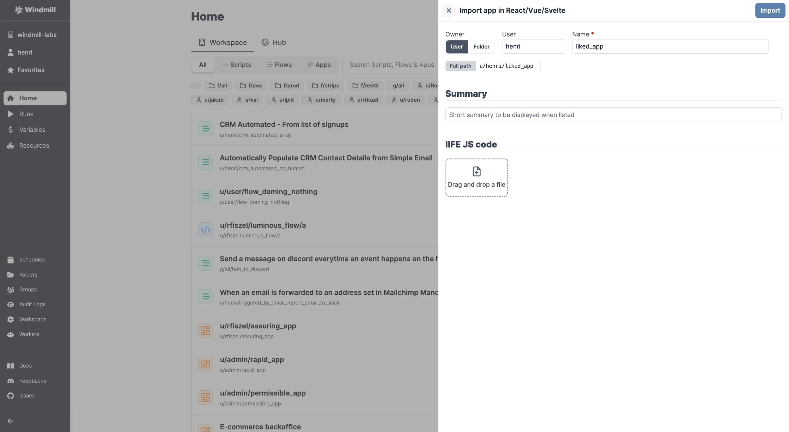

# React App Import

Although Windmill provides a comprehensive [App editor](../getting_started/7_apps_quickstart/index.mdx) to turn scripts and workflows into custom UIs, you might want to import your own Apps in React.

:::info React & Windmill

If you're looking for a way to:

- Import your own components in React that interact with the rest of the [App editor](../getting_started/7_apps_quickstart/index.mdx), see [Import Custom React Components](../apps/4_react_components.md).
- Integrate Windmill applications into React-based project, see [Windmill React SDK](../misc/15_react_sdk/index.md).

:::

Apps in React must follow a template found at https://github.com/windmill-labs/windmill-react-template. In short:

1. `git clone` the react template repo.
2. Run `npm install` and `npm run build`.
3. Drag and drop the result in Windmill:
   - From your workspace, click on the dropdown menu next to `+ App`.
   - Pick `Import app in React/Vue/Svelte`.
   - Drag and drop the file.



The template configures Vite to build IIFE bundle as an output and then import that bundle directly.

For development, at least set a valid user token in .env.development or in .env.development.local:

```js
VITE_TOKEN = your_token;
```

Once deployed on Windmill, the token will be set automatically.

Similar for the user and email, they will be passed in the global context.

:::caution
Do not change `tailwind.css`, it is the exact same than Windmill and allow you to have the same look and feel in development and once deployed as an app on Windmill.
:::
