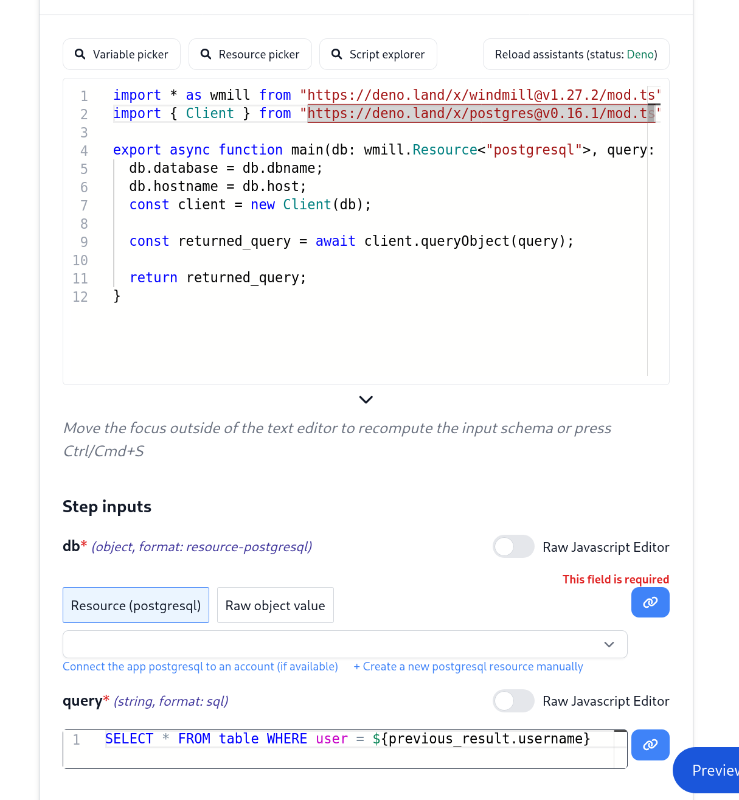
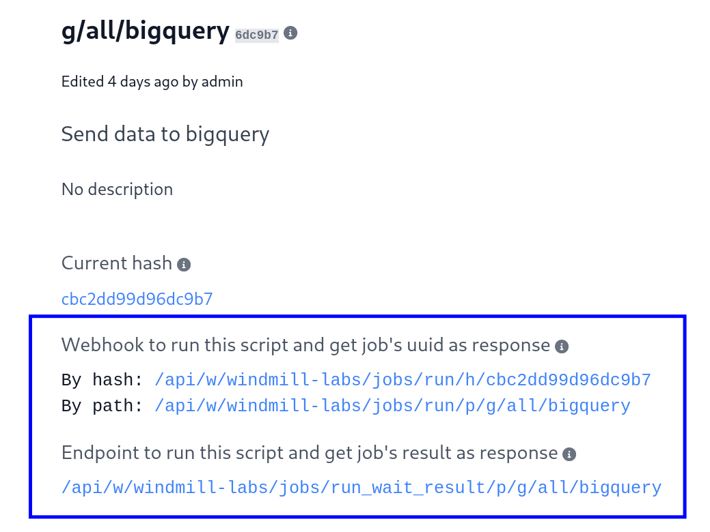
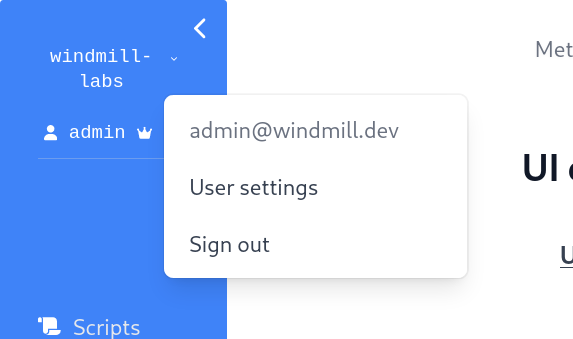
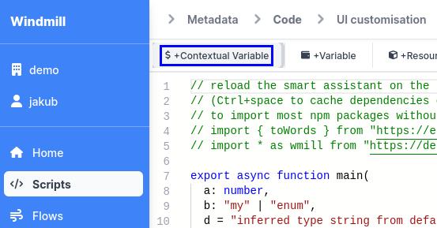

# Reference

This page contains a succinct but precise definition of the different concepts
of windmill.

## Users

Users are uniquely identified globally by their email. They also have a unique
username with respect to each workspace they are member of. An user picks his
username when he joins a workspace.

## Scripts

In Windmill, a script is always a Python, TypeScript (deno), Go or Bash script. Its 2
most important components are its input [JSON Schema](#jsonchema) specification
and its code content. Python and Go scripts also have an auto-genreated lockfile that ensure that executions of the same script always use the exact same set of versioned dependencies. The code must always have a main function:

- Python:

```python
def main(param1: str, param2: dict, ...):
  ...
```

- Typescript:

```typescript
async function main(param1: string, param2: { nested: string }, param3: Resource<'postgres'>) {
  ...
}
```

- Go

```go
func main(x string, nested struct{ Foo string \`json:"foo"\` }) (interface{}, error) {
  ...
}
```

which is its entrypoint when executed as an individual serverless endpoint or a flow module.

### Job Input -> Script Parameters

[Jobs](#Job) take a JSON object/dict as input which can be empty. That input is passed as the payload of the POST request that triggers the script. The different key-value pairs of the objects are passed as the different parameters of the main of the main function, with just a few language
specific transformations from JSON to a more adequate types in the target language if necessary (e.g base64/datetime encoding). Values can be nested JSON objects themselves but we recommend trying to keep the input flat when possible.

### Script hashes

Scripts versions are uniquely defined by their hash. It is an immutable reference similar to a git commit sha. See
[Versioning](#versioning) for more details. Scripts also have a path and many versions share the same path. When a script is saved at a path, it creates a new hash which becomes the "HEAD" of the path, the previous "HEAD" is archived (but still deployed forever).

When a script is saved, it is immediately deployed

### Specific-purpose scripts

You can attach additional functionalities to scripts by specializing them into specific Script kinds.

#### Action

Action are the basic building blocks for the flows.

#### Trigger Scripts

They are used as a first flow step, most commonly with an internal state and a
schedule to watch for changes on an external system, and compare it to the
previously saved state. If there are changes,it  _triggers_ the rest of the flow,
i.e. subsequent scripts.

#### Approval Scripts

Suspend a flow until it's approved. An approval script will interact with the windmill API using any of the windmill clients to retrieve a secret approval URL and resume/cancel endpoints. Most common scenario
for approval scripts is to send an external notification with an URL that can
be used to resume or cancel a flow. For more details check [Suspend/Resume a
flow tutorial](./how-tos/6_suspend_resume_a_flow.md).

#### Error Handlers

Handle errors for flows after all retries attempts have been exhausted. If it does not return an exception itself, the flow is considered to be "recovered" and will have a success status. So in most cases, you will to rethrow an error to have it be listed as a failed flow.

### Automatic UI generation

By reading the main function parameters, Windmill generates the input
specification of the script in the [JSON Schema](https://json-schema.org/)
format. Windmill then renders the flow's or script's UI from that specification.

You do not need to deal with the JSON Schema directly
associated to the script directly. It is the result of the
[analysis of the script parameters of the main function](#script-parameters-to-jsonschema)
and the UI customisation that you can optionaly do.
In the UI customisation interface, you may refine all the information that were not possible to infer directly from the parameters such as restricting a
string to an enum, or precising that a list contains only numbers. You can also
add helpful descriptions to each field.

### JSON Schema

Below is a simplified spec of JSON Schema. See
[here for its full spec](https://json-schema.org/). Windmill is compatible with
the [2020-12 version](https://json-schema.org/draft/2020-12/schema). It is not
compatible with its most advanced features yet.

```json
{
	"$schema": "https://json-schema.org/draft/2020-12/schema",
	"type": "object",
	"properties": {
		"your_name": {
			"description": "The name to hello world to",
			"type": "string"
		},
		"your_nickname": {
			"description": "If you prefer a nickname, that's fine too",
			"type": "string"
		}
	},
	"required": []
}
```

where `properties` contains a dictionary of arguments, and `required` a list of
all mandatory arguments.

The property names need to match the arguments declared by the main function, in
our example `your_name` and `your_nickname`. There is a lot you can do with
[arguments, types, and validation](#jsonschema), but to keep it short:

- Arguments can specify a type `string`, `number` or `object`. User input will
  be validated against that type.
- One can further constraint the type by having the string following a regex or
  pattern, or the object be of a specific [resource type](#resource-type)
- Arguments can be made mandatory by adding them to the `required` list. In that
  case, the generated UI will check that user input provides required arguments.
- Each argument can have a description field, that will appear in the generated
  UI.

### Script parameters -> JSON Schema

There is a one to one correspondence between a parameter of the main function
and a field of `properties` in the JSON Schema. The name of the argument become
the name of the property, and most of the primitive types in Python and
Typescript have a corresponding primitive type in JSON and by extension
JSON Schema.

In Python:

| Python     | JSON Schema                      |
| ---------- | -------------------------------- |
| `str`      | `string`                         |
| `float`    | `number`                         |
| `str`      | `string`                         |
| `float`    | `number`                         |
| `int`      | `integer`                        |
| `bool`     | `boolean`                        |
| `dict`     | `object`                         |
| `list`     | `any[]`                          |
| `bytes`    | `string, encodingFormat: base64` |
| `datetime` | `str, format: date-time`         |
| `_`        | `any`                            |

In Deno:

| Deno       | JSON Schema |
| ---------- | ----------- |
| `string`   | `string`    |
| `object`   | `object`    |
| `boolean`  | `boolean`   |
| `bigint`   | `int`       |
| `number`   | `number`    |
| `string[]` | `string[]`  |
| ...        | ...         |

However in Deno there also some special types that are specific to windmill.
They are as follows:

| Windmill                          | JSON Schema                                  |
| --------------------------------- | -------------------------------------------- |
| `wmill.Base64`                    | `string`, encodingFormat: `base64`           |
| `wmill.Email`                     | `string`, format: `email`                    |
| `wmill.Sql`                       | `string`, format: `sql`                      |
| `wmill.Resource<'resource_type'>` | `object`, format: `resource-{resource_type}` |

`Base64` and `Email` are actually a type alias for `string`, and `Resource` is a
type alias for an `object`. They are purely type hints for the Windmill parser.

The `sql` format is specific to Windmill and replaces the normal text field with
a monaco editor with SQL support.

Note: the equivalent of the type `wmill.Resource<'my_resource_type'>` in Python is to do the following:
```
my_resource_type = dict

def main(x: my_resource_type):
  ...
```

### SQL

For steps and scripts that use sql, you can leverage the Windmill's `Sql` type
to display a monaco editor with SQL support in place of the normal `textarea`.
This allows for the entire query to be passed on as a parameter. For flows, you
can still templatize the SQL query as you would for any script.



### Rich display rendering

The result renderer will by default render results as a pretty JSON. However,
there are some cases that are handled specifically, so-called "rich results".
They are based on the format of the result.

If the result is an object/dict with a single key and that key is:

- `gif`, `png` or `jpeg`: expect the value to be a base64 encoded gif/png/jpeg
  and render it as an image
- `file`: expect the value to be a base64 encoded file and offer it to be
  downloaded

If the result is a list whose first element is also a list, it will display the
result as a table.

If the result is a dict/object where every value is an array, it will also be
displayed as a table, with the key as the column name.

### Versioning

Scripts, when created, can have a parent script identified by its **hash**.
Indeed, scripts are never overwritten, they are instead subsumed by a child
script which corresponds to the new version of the parent script. This
guarantees traceability of every action done on the platform, including editing
scripts. It also enables versioning. Versioning is a good practice from software
engineering which everyone familiar with git already knows. Windmill versioning
is a **simplified git** with two simplifying assumptions:

- **Linearity**: the lineage or the chain of script from the one with no
  ancestor/parent to the one with no child is linear: there is no branching and
  there is no merging.
- **Not diff-based**: every versions of a script contains its entire content and
  not just the diff between him and his direct parent. This is for simplicity
  and read-performance sake.

### Python client

By authenticating with the [reserved variable](#reserved-variable) `WM_TOKEN`,
the python client can interact with the windmill platform from within the script
jobs. This can be used, for instance, to:

- get resources
- run scripts now and read their result synchronously
- schedule a script for later

The python client can be used in any script by using the following prelude:

```python
import wmill

def main(...):
  wmill.get_resource('my_resource_path')
```

### Typescript (deno) client

Similarly for Typescript (deno):

```typescript
import * as wmill from 'https://deno.land/x/windmill/index.ts'

async function main(...) {
  let x = await wmill.getResource('u/user/name')
}
```

### Dependency management

For Typescript (Deno), the dependencies and their versions are directly in the
script and hence there is no need for any additional steps.

For Python, the imports are automatically analyzed when the script is saved
and the corresponding list of Pypi packages is extracted. A dependency job is
then spawned to associate that list of Pypi packages with a lockfile, which
will lock the versions. This ensures that the same version of a python script
is always executed with the same versions of its dependencies. It also avoids
the hassle of having to maintain a separate requirements file.

If the imports are not properly analyzed, there exists an escape hatch to
override the input of the dependency job. One needs to head the script with the
following comment:

```python
#requirements:
#dependency
#version_pinned_dependency==0.4

import dependency

def main(...):
  ...
```

In addition to that, environment variables can be set to customize
`pip`'s index-url and extra-index-url. This is useful for private repositories.

In a docker-compose file, you would add following lines:

```dockerfile
windmill:
  ...
  environment:
    ...
    - PIP_INDEX_URL=https://pypi.org/simple
    - PIP_EXTRA_INDEX_URL=https://pypi.org/simple
    - PIP_TRUSTED_HOST=pypi.org
```

### Python relative imports for sharing common logic

It is possible to import directly from other python scripts. One can simply follow the path layout. For instance, `import foo from f.<foldername>.script_name`. A fuller example below:

```python
# u/rubenfiszel/common_logic

def foo():
  print('Common logic!')

```

And in another script:
```python
from u.rubenfiszel.common_logic import foo

def main():
  return foo()
```

It works with scripts contained in folders, and in scripts contained in user-spaces.
e.g: 
`f.<foldername>.script_path`
`u.<username>.script_path`

Beware that you can only imports scripts that you have visibility on. Furtheremore, if you make any import in the common logic, you will need to add the same import in the script that imports it as well otherwise the automatic dependency management will not work.

The folder layout follow exactly the one of the CLI for syncing scripts locally and on windmill. As a consequence, the IDE will treat it as a relative imports and will behave as expected.

### Deno relative imports for sharing common logic

Similarly to python, it is possible to import directly from other typescript scripts. One can simply follow the path layout. For instance, `import { foo } from "/f/<foldername>/script_name.ts"`. A fuller example below:

```typescript
import { main as foo, util } from "/f/common/my_script_path.ts"

export async function main() {
  await foo()
  util()
}
```

## Flows

A **Flow** is a core concept. It is a json serializable value
in the [OpenFlow](./openflow) format that consists of an input spec (similar to
scripts), and a linear sequence of steps also referred to as modules. Each step
consists of either:

- Reference to a script from the hub
- Reference to a script in your workspace
- Inlined script in Python, Typescript (deno), Go Bash
- Trigger scripts which are a kind of scripts that are meant to be first step of a scheduled flow that watch for external events and early exit the flow if there is no new events
- `forloop` that iterates over elements and triggers the execution of an
  embedded flow for each element. The list is calculated dynamically as an
  [input transform](#input-transform).
- Branches to one subflow given for the first predicate that match (evaluated in-order)
- Branches to all subflow and collect the result of each branch as an array
- Approval/Suspend steps which suspend the flow at no cost until it is resumed by getting an approval/resume signal. [More details](#approval-scripts)
- Inner flows

With the mechanism of [input transforms](#input-transform), the input of any
step can be the output of any previous step, hence flows are actually
[Directed Acyclic Graph (DAG)](https://en.wikipedia.org/wiki/Directed_acyclic_graph)
rather than sequences. You refer to the result of any step using its step id.

## Retries

Every step of a flow can be configured with two types of retries: regular intervals and
exponential back-off. They can be applied independently, or jointly.

Both strategies are based on the number of retries and the time interval 
to be applied between them.

Strategies can also be combined, in which case, the linear strategy 
(regular intervals) will be applied first, followed by the exponential 
back-off strategy.

The retries are tried when a step errors, until there are no retries attempt left, in which case the flow either pass the error to the [error handler](#error-handlers) if any, or fail the flow itself if no error handler.

## Input Transform

Every step has an input transform that maps from:

- the flow input
- any step's result, not only the previous step's result
- resource/variable

to the different parameters of this specific step.

It does that using a javascript expression that operates in a more restricted
setting. That javascript is using a restricted subset of the standard library +
5 functions which are belows:

- `flow_input`: The dict/object containing the different parameters of the flow
  itself
- `results.{id}`: The 
- `resource(path)`: The resource at path
- `variable(path)`: The variable at path

Using javascript in this manner, for every parameter, is extremely flexible and
allows Windmill to be extremely generic in the kind of modules it runs.

For each field, one has the option to write the javascript directly or to use
the quick connect button if the field map one to one with a field of the
`flow_input`, a field of the `previous_result` or of any steps.

### Trigger scripts

A trigger script is a script whose purpose is to be used as a first step of a
flow. In combination with a schedule, flows can react to external changes and
continue triggering the rest of the flow with the changes being listened to as
new elements.\
It is not very different than any other script except its purposes and that it
needs to return a list because the next step will be to forloop over all items
of the list in an embedded flow. Furthermore, it will very likely make use of
the convenience helper functions around [internal states](#internal-state).

### State / Internal State

An internal state is just a state which is meant to persist across distinct
executions of the same script. This is what enables flows to watch for changes
in most event watching scenarios. The pattern is as follows:

- retrieve the last internal state or, if undefined, assume it is the first
  execution
- retrieve the current state in the external system you are watching, e.g. the
  list of users having starred your repo or the maximum id of posts on Hacker
  News
- calculate the difference between the current state and the last internal
  state. This difference is what you will want to act upon.
- set the new internal state as the current state so that you do not process the
  elements you just processed
- return the differences calculated previously so that you can process them in
  the next steps. You will likely want to forloop over the items and trigger one
  flow per item. This is exactly the pattern used when your flow is in mode
  "Watching changes regularly"

The convenience functions do this in Typescript are:

- `getState`
  which retrieves an object of any type (internally a simple resource) at a path
  determined by
  `getStatePath` a path unique to the user currently executing the script,
  the flow in which it is currently in if it is in one and the path of the
  script
- `setState` which sets the new state

The states can be seen in the [Resources](#resource) section with a
[Resource type](#resource-type) of `state`.

## WindmillHub

The WindmillHub at <https://hub.windmill.dev> is a community hub to ask and
share generic task-specific scripts, trigger-scripts, flows that be reused in
everyone's flow in order to not have to reinvent the wheel.

## Endpoints to trigger scripts and flows

The script triggers urls are always available on the script details page.



For all of those REST endpoints, the input of the script or flow must be passed
as a json payload that fits the JSON Schema spec of that script or flow. Those
endpoints are authenticated and will require a bearer token of the format:
`Authorization: Bearer XXX`. You can create a token in your user settings.



### Webhooks

Every script or flow can be run by its hash or path as a http request aka as
"Webhook". You can find the webhook in the script or flow details page but the
target URL follows this format:

<!-- FIXME: Update URLs after merging #336 -->

- Flow by path:
  <https://app.windmill.dev/api/w/$WORKSPACE_ID/jobs/run/f/$FLOW_PATH>
- Script by hash:
  <https://app.windmill.dev/api/w/$WORKSPACE_ID/jobs/run/h/$SCRIPT_HASH>
- Script by path:
  <https://app.windmill.dev/api/w/$WORKSPACE_ID/jobs/run/p/$SCRIPT_PATH>

### Synchronous endpoint for scripts

aka "Lambda style" endpoints

Every script also exposes an endpoint that triggers the script but waits for its
full execution before returning. The endpoint is:
<https://app.windmill.dev/api/w/$WORKSPACE_ID/jobs/run_wait/result/$SCRIPT_PATH>

## Jobs

A job represents a past, present or future "task" or "work" to be executed by a
[worker](#workers). Future jobs or jobs waiting for a worker are called "queued
jobs", and are ordered by the time at which they were scheduled for
(`scheduled_for`). Jobs that are created without being given a future
`scheduled_for` are scheduled for the time at which they were created.

[Workers](#workers) fetch jobs from the queue, start executing them, atomically
set their state in the queue to "running", stream the logs while executing them,
then once completed remove them from the queue and create a new "completed job".

Every job has a unique UUID attached to it and as long as you have visibility
over the execution of the script, you are able to inspect the execution logs,
output and metadata in the dedicated details page of the job.

### Jobs kinds

There are 5 main kinds of jobs, that each have a dedicated tab in the runs page:

- **Script Jobs**: Run a script as defined by the hash of the script (that
  uniquely and immutably defines a specific version of a script), its input
  arguments (args) and the `permissioned_as` user or group of whom it is gonna
  act on behalf of and inherit the visibility to other items such as resources
  and variables from. An user can **NEVER** escalates his privileges but only
  de-escalates it by launching a script with either the same permissions as
  himself or a subset of it (by giving the permissions of a group that he is
  member of).

- **Preview Jobs**: similar to script jobs but instead of hash, they contain the
  whole raw code they will run. Those are the jobs that are launched from the
  script editors. Even when code is executed as a preview, you keep a trace of
  its execution.

- **Dependencies Jobs**: Scripts written in python generate a lock file when
  they are saved/created. This lockfile ensures that an execution of the same
  hash will always use the same versions. The process of generating this
  lockfile is also a job in itself so you can easily inspect the issues
  generating the lockfile if any. See
  [Dependency Management](#dependency-management) for more information.

- **Flow Jobs**: A flow job is the "meta" job that orchestrates the execution of
  every step. The execution of the steps are in-themselves jobs. It is defined
  similarly to a script job but instead of being defined by a path to a script,
  it is defined by a path to the flow.

- **Preview Flow Jobs**: A preview flow is a job that contains the raw json
  definition of the flow instead of merely a path to it. It is the underlying
  job for the preview of flows in the flow editor interface.

### Jobs are run on behalf of

The `permissioned_as` value from script and preview jobs is the most important
concept to grasp to understand what makes Windmill's security and permission
model consistent, predictable and safe. `permissioned_as` is distinct from the
`created_by` value, even though in the vast majority of jobs, they will be the
same. It represents the level of permissions this job will execute with. As a
direct consequence, the variables (including secrets) that are accessible to the
scripts are only those whom the user or group has visibility on, given his
[permissions](#permissions).

Similarly for the [Contextual Variable](#contextual-variables) `WM_TOKEN` which
contains an ephemeral token (ephemeral to the script execution), which has the
same privilege and permissions as the owner in `permissioned_as`. The
[python client](#client) inside the script implicitly uses that same token to be
granted privilege to do windmill operations (like running other scripts or
getting resources), meaning that the same script ran by 2 different users, will
run differently and may be unauthorized to do partially or all operations of the
script. This is what enables anyone to share scripts doing sensitive operations
safely as long as the resources and secrets that the script relies on are
permissioned correctly.

A user can only run a script permissioned as either himself, one of the group
that he is a member of.

## Workers

Workers are autonomous processes that run one script at a time using the full
machines resources available to them.

Workers pull [jobs](#job) from the queue of jobs in the order of their
`scheduled_for` datetime as long as it is in the past. As soon as a worker pulls
a job, it atomically sets its state to "running", runs it, streams its logs then
once it is complete, saves it back in the database as a "complete job". The
final result and logs are stored forever.

The number of workers can be horizontally scaled up or down depending on needs
without any overhead.

## Variables

Variables are dynamic values that have a key associated to them and can be
retrieved during the execution of a script or flow.

All variables (not just secrets) are encrypted with a workspace specific
symmetric key to avoid leakage.

There are two types of variables in Windmill.

### User-defined Variables

User-defined Variables is essentially a key-value store where every user can
read, set and share values at given keys as long as they have the privilege to
do so.

They are editable in the UI and also readable if they are not
[Secret Variables](#secret-variables)

Inside the scripts, one would use the windmill client to interact with the
user-defined variables.

Python:

```python
import wmill

wmill.get_variable("u/user/foo")
wmill.set_variable("u/user/foo", value)
```

Typescript (deno):

```typescript
import * as wmill from 'https://deno.land/x/windmill/index.ts';

wmill.getVariable('u/user/foo');
wmill.setVariable('u/user/foo', value);
```

Note that there is a similar api for getting and setting [resources](#resource) which are simply variables that can contain any json values, not just string and that are labeled with a [resource type](#resource-type) to be automatically discriminated in the auto-generated form to be of the proper type (e.g a parameter in Typescript of type `pg: wmill.Resource<'postgres'>` is only gonna offer a selection over the resources of type postgres in the auto-generated UI)

There is also a concept of [state](#state--internal-state) to share values across script executions.

#### Secret Variables

[User-defined Variables](#user-defined-variables) can be set as **Secret**. Once
set, secret variables cannot be viewed from the dashboard, making sure no
accidental leakage is possible. Note that a script could still print out a
secret variable. While this is possible, a malicious user cannot leak a secret
variable discretely as every version of any scripts is stored forever with its
hash, and both the edit and the execution would be visible from the
[audit logs](#audit-log).

### Contextual Variables

Contextual variables are variables whose values are contextual to the script
execution. This is how the Deno and Python windmill client get their implicit
credentials to interact with the platform.

| Name           | Value                                                                                                               |
| -------------- | ------------------------------------------------------------------------------------------------------------------- |
| `WM_TOKEN`     | Token ephemeral to the current script with equal permission to the permission of the run (Usable as a bearer token) |
| `WM_EMAIL`     | Email of the user that executed the current script                                                                  |
| `WM_USERNAME`  | Username of the user that executed the current script                                                               |
| `WM_JOB_ID`    | Job id of the current job                                                                                           |
| `WM_WORKSPACE` | The workspace id of the current job                                                                                 |

You can use them in a script by clicking on "Contextual Variable":



## Resource

A resource is similar to a [variable](#variables) in that it stores a
permissioned value that is meant to be used by scripts. However, a resource
represents a "complex" object: a JSON object. That JSON object is constrained by
its [resource type](#resource-type) JSON Schema, the same way the possible input
of a scripts are constrained by the input JSON Schema. An example of resource is
the demodb schema:

```json
{
	"dbname": "demo",
	"host": "demodb.delightool.xyz",
	"password": "demo",
	"port": 6543,
	"sslmode": "disable",
	"user": "demo"
}
```

A resource string can refer to a [variable](#variables) using the following
pattern:

```
$var:path
```

for instance:

```json
{
	"simple": "$var:u/user/foo"
}
```

This is most useful when dealing with sensitive values that should be treated as
secrets.

### The special resource type payload

In JSON payloads, instead of passing an object with their values, one can use
the string `$res:u/user/foo` where the second part is the path of the resource.
The worker will fetch the corresponding object and switch the string with the
object value before triggering the script or the flow.

### Resource type

Resource types have a name and a [JSON Schema](#jsonschema) value. A resource is
constrained by its resource type. An example of a resource type is for instance
a postgres connection, shortened as `postgresql` and whose schema is:

```json
{
	"$schema": "https://json-schema.org/draft/2020-12/schema",
	"properties": {
		"dbname": {
			"description": "The database name",
			"type": "string"
		},
		"host": {
			"description": "The instance host",
			"type": "string"
		},
		"password": {
			"description": "The postgres users password",
			"type": "string"
		},
		"port": {
			"description": "The instance port",
			"type": "integer"
		},
		"sslmode": {
			"description": "The sslmode",
			"enum": ["disable", "allow", "prefer", "require", "verify-ca", "verify-full"],
			"type": "string"
		},
		"user": {
			"description": "The postgres username",
			"type": "string"
		}
	},
	"required": ["dbname", "user", "password"],
	"type": "object"
}
```

Same as for the input spec of a script, you do not have to deal with the
JSON Schema directly and should use the UI builder to edit the schema.

## Schedule

A schedule is defined by a [path](#path), a periodicity
[as a cron string](https://en.wikipedia.org/wiki/Cron#Overview), a script hash
to trigger and the args to provide to the script to run it.

An example of a schedule periodicity/cron is: `0 */15 * * * *` which corresponds
to "trigger this every 15 mins".

The immediate next execution of a schedule is always in the [job](#job) queue.

Schedules can not be deleted but they can be disabled.

## Workspace

Every nameable or pathable entity in Windmill has a workspace attached to it.
This includes:

- users
- [groups](#group)
- [scripts](#script)
- [resources](#resource)
- [variables](#variable)
- [schedules](#schedules)
- [jobs](#job)

Windmill's entire database is partitioned by workspaces such that users, teams
and orgs can safely co-locate without risk of leakage.

Any user can create his own workspace. When a user creates a workspace, he is an
admin of such workspace and he can invite others to join his workspace.

## Path

Windmill uniquely identifies [scripts](#script), [variables](#variable),
[resources](#resources), [schedules](#schedule) resources using their path. The
paths are globally unique within the category of entities they represent (so a
resource and a schedule can have the same path for instance without conflict.)

A path looks like `<owner-kind>/<owner-name>/<resource-name>`:

- `<owner-kind>/<owner-name>` is the **ownership path prefix** part which is
  itself made of 2 sub-parts. There are only 2 owners kinds, [group](#group) and
  users. For paths, the owner kind for group is shortened to `g` and for user it
  is shortened to `u`. The owner name corresponds to the name of the group or
  the username of the user.
- **resource-name** is the name of the resource itself

Examples:

- a private script `u/alice/hello_world`
- a script available to the users of the all group (so all users)
  `g/all/hello_world`

## Owner

An owner is the user or group identified in a [path](#path) through the
"ownership path prefix" (`u/<user>` or `g/<group>`). An owner always has write
[permission](#permission-and-acl) over the entity.

## Groups

Groups have a name and a set of members. They are inspired by unix groups:

- Members are always users
- Users can be members of multiple groups

Groups can own entities: the ownership path prefix of those entities are of the
form `g/<group>` and can be granted or shared read or write
[permissions](#permission-and-acl) to entities.

Members of a group have permissions to act on behalf of a group. Groups
themselves are permissioned such that only admin and users with write permission
on the group name can add or remove users from a group. Being a member of a
group does not grant write permission on the group itself.

### The 'all' Group

The `all` group is a special group that automatically contains all users of a
[workspace](#workspace).

## Permissions and ACL

Windmill includes fine-grained ACL by default for all kind of pathable entities:

- [groups](#group)
- [scripts](#script)
- [resources](#resource)
- [variables](#variable)
- [schedules](#schedules)
- [jobs](#job)

Every entity is writable by their [owner](#owner) and readable by none others
except when being shared specifically to other groups and users. An entity can
be shared in read-only or read+write mode. Write mode implicitly contains read
permission. The write mode enables to delete, rename and change the sharing of
an entity so be careful with whom you share with in write mode.

Admins of a [workspace](#workspace) ignore all ACLs and can read and write over
everything.

## Audit Log

Every operation, and actions that have side-effects (so every action except
getting or listing entities) have a log attached to them which contains the user
at the origin of the operation and some metadata specific to the kind of
operation. Every kind of audit log has a hierarchical operation name attached to
them. Admins of a workspace can see the audit logs of every users of a
[workspace](#workspace). Simple users can only see their own audit logs. Audit
logs have different retention policy depending on the plan your team is on.
