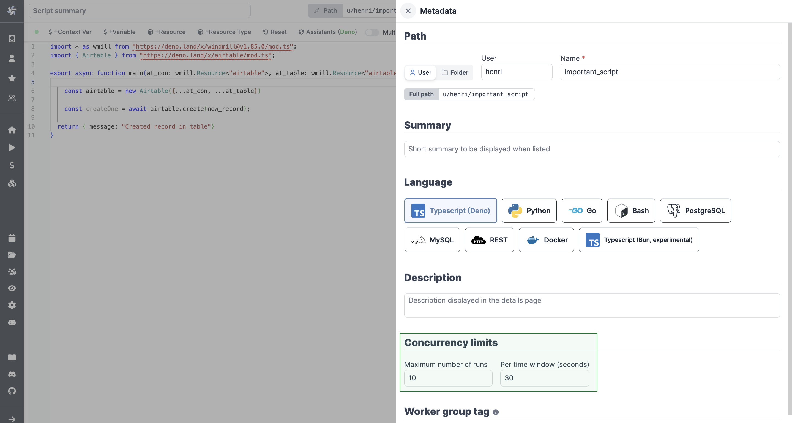

# Concurrency Limits

The Concurrency Limits feature allows you to define concurrency limits for scripts, flows and inline scripts within flows. Its primary goal is to prevent exceeding the API Limit of the targeted API, eliminating the need for complex workarounds using worker groups.

Concurrency limit is a [Cloud plans and Pro Enterprise Self-Hosted](/pricing) only.

## How it Works

The Concurrency Limit operates globally and across flow runs. It involves two key parameters: "Maximum number of runs" and the "Per time window (seconds)."

Concurrency limit can be set from the Settings menu.

When jobs reach the concurrency limit, they are automatically queued for execution at the next available optimal slot given the time window.
