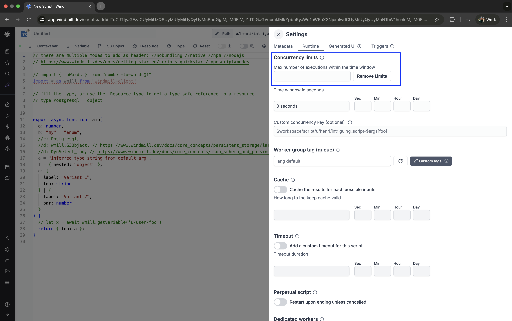

# Concurrency Limit

The Concurrency Limit feature allows you to define concurrency limits for scripts and inline scripts within flows. Its primary goal is to prevent exceeding the API Limit of the targeted API, eliminating the need for complex workarounds using worker groups.

## How it Works

The Concurrency Limit operates globally and across flow runs. It involves two key parameters: "Maximum number of runs" and the "Per time window (seconds)."

Concurrency limit can be set from the metadata menu.

When jobs reach the concurrency limit, they are automatically queued for execution within the specified time window. This ensures that the execution of queued jobs is distributed evenly and optimizes resource allocation.