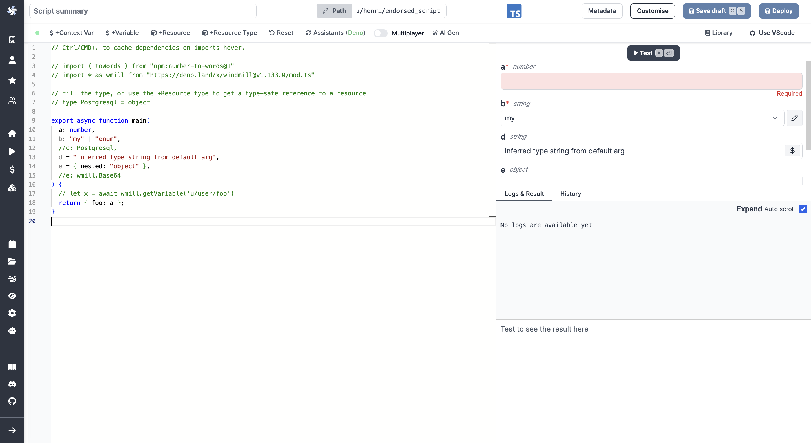

import DocCard from '@site/src/components/DocCard';

# Script Editor

In Windmill, Scripts are the basis of all major features (they are the steps of [flows](../getting_started/6_flows_quickstart/index.mdx), [linked to apps components](../apps/3_app-runnable-panel.mdx), or can be [run as standalone](../getting_started/8_trigger_scripts/index.mdx)).

A Script can be written in:
[TypeScript (Deno)](../getting_started/0_scripts_quickstart/1_typescript_quickstart/index.mdx),
[Python](../getting_started/0_scripts_quickstart/2_python_quickstart/index.mdx),
[Go](../getting_started/0_scripts_quickstart/3_go_quickstart/index.mdx),
[Bash](../getting_started/0_scripts_quickstart/4_bash_quickstart/index.mdx) or
[SQL](../getting_started/0_scripts_quickstart/5_sql_quickstart/index.mdx). Its
two most important components are the input [JSON Schema](../core_concepts/13_json_schema_and_parsing/index.md)
specification and the [code content](../code_editor/index.mdx).



Python and Go Scripts also have an
auto-generated lockfile that ensure that executions of the same Script always
use the exact same set of versioned dependencies. The code must always have a
main function, which is its entrypoint when executed as an individual serverless
endpoint or a [Flow](../flows/1_flow_editor.mdx) module:

TypeScript:

  ```typescript
  async function main(param1: string, param2: { nested: string }) {
  	...
  }
  ```

Python:

  ```python
  def main(param1: str, param2: dict, ...):
  	...
  ```

Go:

  ```go
  func main(x string, nested struct{ Foo string \`json:"foo"\` }) (interface{}, error) {
  	...
  }
  ```

Bash:

There is no main needed for Bash. The body is executed and the args are passed directly.

<div class="grid grid-cols-2 gap-6 mb-4">
	<DocCard
		title="Scripts Quickstart"
		description="Start writing scripts in Python, TypeScript, Go, Bash and Sql."
		href="/docs/getting_started/scripts_quickstart"
	/>
    <DocCard
		title="Code Editor"
		description="The code editor is Windmill's integrated development environment."
		href="/docs/code_editor"
	/>
    <DocCard
		title="JSON Schema and Parsing"
		description="JSON Schemas are used for defining the input specification for scripts and flows, and specifying resource types."
		href="/docs/core_concepts/json_schema_and_parsing"
    />
    <DocCard
		title="Auto-generated UIs"
		description="Windmill creates auto-generated user interfaces for scripts and flows based on their parameters."
		href="/docs/core_concepts/auto_generated_uis"
	/>
    <DocCard
		title="Triggering Scripts"
		description="Trigger flows on-demand, by schedule or on external events."
		href="/docs/getting_started/trigger_scripts"
	/>
</div>

The Script Editor is made of the following features:

<div class="grid grid-cols-2 gap-6 mb-4">
	<DocCard
		title="Metadata"
		description="Each script has metadata associated with it, enabling it to be defined and configured in depth."
		href="/docs/script_editor/metadata"
	/>
    <DocCard
		title="Script Kinds"
		description="You can attach additional functionalities to Scripts by specializing them into specific Script kinds."
		href="/docs/script_editor/script_kinds"
	/>
    <DocCard
		title="Customize Arguments"
		description="Some arguments' types can be given advanced settings that will affect the inputs' auto-generated UI and JSON Schema."
		href="/docs/script_editor/customize_arguments"
    />
    <DocCard
		title="Versioning"
		description="Windmill creates auto-generated user interfaces for scripts and flows based on their parameters."
		href="/docs/script_editor/versioning"
	/>
    <DocCard
		title="Worker Group Tag"
		description="Scripts can be assigned custom worker groups for efficient execution on different machines with varying specifications."
		href="/docs/script_editor/worker_group_tag"
	/>
	<DocCard
		title="Concurrency Limit"
		description="The Concurrency Limit feature allows you to define concurrency limits for scripts and inline scripts within flows."
		href="/docs/script_editor/concurrency_limit"
    />
	<DocCard
		title="Custom Environment Variables"
		description="In a self-hosted environment, Windmill allows you to set custom environment variables for your scripts."
		href="/docs/script_editor/custom_environment_variables"
	/>
	<DocCard
		title="Custom Response Code"
		description="For all sync run jobs endpoints, if the response contains a key `windmill_status_code` with a number value, that value will be used as the status code."
		href="/docs/script_editor/custom_response_code"
	/>
    <DocCard
		title="Multiplayer"
		description="The Multiplayer feature allows you to collaborate with team members on scripts simultaneously."
		href="/docs/script_editor/multiplayer"
	/>
    <DocCard
		title="Write Scripts on VSCode"
		description="The Windmill VSCode extension allows you to run your scripts and preview the output within VSCode."
		href="/docs/script_editor/vs_code_scripts"
	/>
</div>