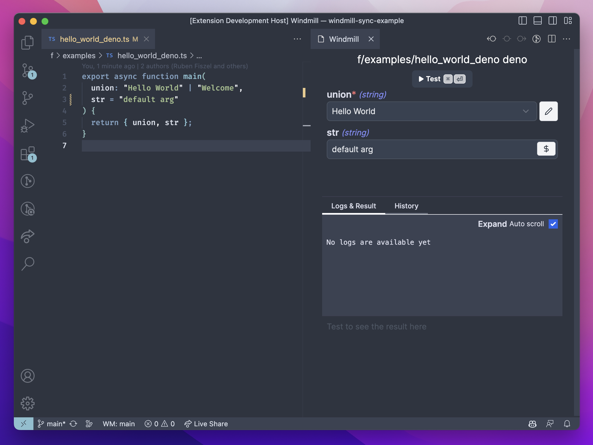

import DocCard from '@site/src/components/DocCard';

# Write Scripts on VSCode

The Windmill VSCode extension allows you to run your scripts and preview the output within VSCode. This feature lets you preview your work without leaving your code editor.

<iframe
	style={{ aspectRatio: '16/9' }}
	src="https://www.youtube.com/embed/aSOF6AzyDr8?vq=hd1080"
	title="YouTube video player"
	frameBorder="0"
	allow="accelerometer; autoplay; clipboard-write; encrypted-media; gyroscope; picture-in-picture; web-share"
	allowFullScreen
	className="border-2 rounded-xl object-cover w-full dark:border-gray-800"
></iframe>

 

	<DocCard
		title="VSCode Extension"
		description="The Windmill VSCode extension allows you to run your scripts and preview the output within VSCode."
		href="/docs/cli_local_dev/vscode-extension"
	/>

